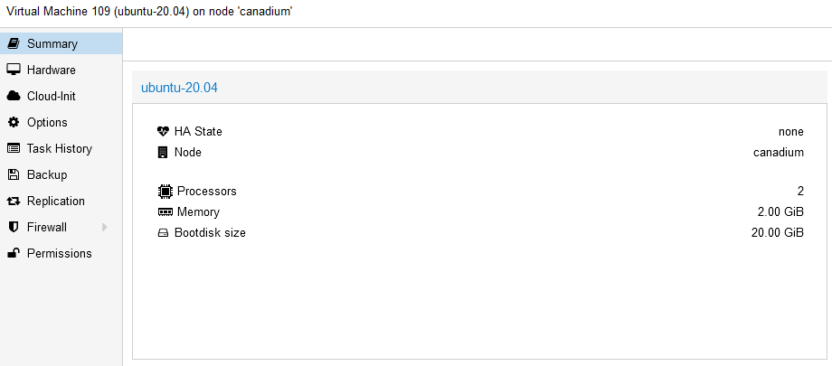
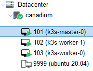

# Architecture

je suis en train de préparer la Certified Kubernetes Administrator (CKA) et il me faudrait un lab pour m'exercer. J'ai pas mal fait de Kubernetes classique en lab via des foramtions Udemy et j'aimerai tester autre chose mais toujours sur une base K8S. 
Je me suis donc penché sur K3S de Rancher. Il dispose de plusieurs qualité qui me semble intéressantes : 
- Il est léger et plus rapide que K8s
- Il peut s'exécuter sur du plus petit matériel (proc ARM par ex 🥰). J'ai comme projet potentiel de faire un cluster de raspberry donc K3S est plus qu'indiqué.
- Il ne dispose pas de tous les connecteurs cloud mais vu que ça sera du on premise dans mon cas c'est parfait.
- Plein de petits avantages : + facile et rapide à déployer, moins de surface d'attaque, facile à update etc...

Par contre il ne fait pas tourner docker nativement mais containerd (bien que j'ai vu un projet passer s'appelant k3d qui intègre docker), ça sera l'occasion d'apprendre autre chose surtout que le CRI (Container Runtime Interface) en soi n'est pas le plus important.

Une fois mon choix d'orchestrateur choisi je me suis dit que j'allais installer mon cluster K3s sur mon lab maison qui exécute un Proxmox et tant qu'à faire autant avoir un workflow de déploiement un peu évolué pour s'éxercer.

Parmi toutes les ressources que j'ai pu voir celle qui me semblait au départ le plus intéressant faisait les choses suivantes : 
- Récupération de l'ISO Ubuntu 20 sur Proxmox
- Création du template Proxmox "à la main" via des commandes qm (cli proxmox)
- Configuration de cloud init via l'onglet promox dédié
- Création des VM via Terraform 
- Ansible pour dépoyer K3s sur mes nouvelles VM

Ca paraissait sympa sur le papier et puis ça permettait de mettre en application les quelques connaissances Terraform dont je disposais. 
Mais à bien réfléchir il y avait quand même deux problèmes dans ce process : 
- Une partie manuelle qui cassait un peu l'automatisation voulue. Si je pouvais automatiser cela je serai vraiment dans un cas d'IaC (**Infra As Code**)
- Pas très flexible cat si je veux customiser mon template ça sera à la main aussi ou a la limite via script bash

C'est là que je suis tombé sur un autre outil d'Hashicorp qui fait tout ce travail manuel pour moi et dispose de la flexibilité voulue : Packer !

</br>Voici les deux workflow qui sont ressortis au final : 

- Creation du template --> Cloud init --> Terraform --> Ansible --> K3S  
- **Packer (+Cloud init) --> Terraform --> Ansible --> K3S**

J'ai donc choisi le deuxième worflow  
Avantages :
- Infra as code - Full automatisée
- Pas d'intéraction directe avec Proxmox, seulement via son API
- Peut donc être piloté depuis une machine tiers

Inconvénients:
- ⚠️Necessite plus de developpement et de temps pour un résultat équivalement dans mon cas (installation d'un potentiel DHCP, creation du fichier de conf packer etc...)
- Temps d'exécution de création du template plus long

Retrouver l'ensemble du projet sur ce git : https://github.com/ramuskay/k3s-proxmox-terraform-ansible-packer

# Packer

Je vais donc utiliser packer pour packager mon image ubuntu 20.04 avec quelques packages et conf additionnelles. Il suffit d'installer [packer](https://www.packer.io/downloads) puis nous verrons les fichiers de configuration.  
D'ailleurs dans mon cas pas besoin de DHCP, celui de ma box avec ma VM template en mode bridge sera largement suffisant.  
Voici mon aborescence packer pour la config : 
```
├── http
│   ├── meta-data
│   └── user-data
├── ubuntu20.pkr.hcl
└── variables.pkr.hcl
```

Les fichiers de conf peuvent être en json ou HCL (format hashicrop), j'ai choisi HCL à la place de JSON pour deux raisons : 
- Language commun avec tous les outils HashiCorp (vu qu'on va aussi utiliser Terraform ça a du sens)
- Plus "fonctionnel", on peut par exemple mettre des commentaires (dans JSON non ça fera partie de la data)

On a donc 3 fichiers hcl concernant : 
- `variables.pkr.hcl` : la définition des variables par défaut
- `ubuntu20.pkr.hcl` : la définition du job packer

Regardons plus en détail `ubuntu20.pkr.hcl` : 

```ruby
source "proxmox" "template" {
  proxmox_url = "${var.proxmox_hostname}/api2/json"
  username = var.proxmox_username
  password = var.proxmox_password
  node = var.proxmox_node_name
  insecure_skip_tls_verify = var.proxmox_insecure_skip_tls_verify
  network_adapters {
    bridge = "vmbr0"
  }
  disks {
    type = "scsi"
    disk_size = "20G"
    storage_pool = var.vm_storage_pool
    storage_pool_type = "lvm"
  }
  #iso_file = "local:iso/ubuntu-20.04.4-live-server-amd64.iso"
  iso_url               = var.iso_url
  iso_storage_pool      = var.iso_storage_pool
  iso_checksum          = var.iso_checksum
  unmount_iso = true
  boot_wait = "5s"
  memory = var.vm_memory
  sockets   = var.vm_sockets
  cores     = var.vm_cores
  template_name = var.vm_name
  vm_id     = var.vm_id
  http_directory = var.http_directory
  cloud_init = true
  cloud_init_storage_pool = var.iso_storage_pool
  boot_command = [
    "<esc><wait><esc><wait><f6><wait><esc><wait>",
    "<bs><bs><bs><bs><bs>",
    "autoinstall ds=nocloud-net;s=http://{{ .HTTPIP }}:{{ .HTTPPort }}/ ",
    "--- <enter>"
  ]
  ssh_username = var.username
  ssh_password = var.user_password
  ssh_timeout = "20m"
}

build {
  sources = [
    "source.proxmox.template"
  ]
  provisioner "shell" {
    inline = [
      "sudo rm -f /etc/cloud/cloud.cfg.d/99-installer.cfg",
      "sudo rm -f /etc/cloud/cloud.cfg.d/subiquity-disable-cloudinit-networking.cfg",
      "sudo cloud-init clean"
    ]
  }
}
```
Rien de bien compliqué là dedans c'est aussi l'avantage en général des outils Hashicorp la configuration est très descriptive et donc compréhensible rapidement.
On va renseigner les informations suivantes : 
- Des credentials pour le proxmox
- Un peu de hardware pour le template (RAM, CPU, Disk etc...)
- Une config pour le template (ID, nom, boot command , ssh cred etc...)
- Un dossier pour la conf subiquity
- **On active cloud-init car sinon on ne peut pas set les IP via Terraform**
- On tweak un peu l'image car on veut qu'elle soit cloud-init ready

Justement concernant autoinstall depuis la version 20.04 preseed a été délaissé au profit de subiquity qui est (de mon point de vue) bien plus facile à utiliser car format yaml et s'intègre très bien avec Packer. Ce qui donne deux fichiers : 
- `meta-data` : requis. Utilisé par le cloud vu qu'on déploit en local on le laisse vide
- `user-data` : l'équivalent du preseed, utilise autoinstall

Le fichier `user-data` en détail :
```yml
#cloud-config
autoinstall:
  version: 1
  locale: en_US
  keyboard:
    layout: fr
  ssh:
    install-server: true
    allow-pw: true
  packages:
    - qemu-guest-agent
  user-data:
    users:
        - name: canadium
          passwd: $6$exDY1mhS4KUYCE/2$zmn9ToZwTKLhCw.b4/b.ZRTIZM30JZ4QrOQ2aOXJ8yk96xpcCof0kxKwuX1kqLG/ygbJ1f8wxED22bTL4F46P0
          groups: [adm, cdrom, dip, plugdev, sudo]
          lock-passwd: false
          sudo: ALL=(ALL) NOPASSWD:ALL
          shell: /bin/bash
          ssh_authorized_keys:
            - ssh-ed25519 AAAAC3NzaC1lZDI1NTE5AAAAIJEXrwiuUOCpWPvwOsGuF4K+aq1ufToGMi4ra/1omOZb
```

Fichier de configuration ultra basique, on définit un seul user et deux conf pour le système. Les autres options peuvent être trouvées dans la [doc](https://ubuntu.com/server/docs/install/autoinstall-reference)  
⚠️ Ce fichier est "templatiser" et redéfini via Terraform voir plus bas

On peut suite éxécutera ensuite packer via Terraform pour avoir une seule et même exécution  
Ce qui nous donne un template de qualité ! 


# Terraform

Il faut maintenant déployer notre templates sous forme de VM, on va utiliser terraform pour cela qui va également nous préparer nos fichiers ansible.
On installe [Terraform](https://learn.hashicorp.com/tutorials/terraform/install-cli?in=terraform/aws-get-started) puis on s'attaque aux fichier de configuration : 
```
├── main.tf
├── output.tf
├── provider.tf
├── terraform.tfvars
└── variables.tf
```

Listons les fichiers terraform :
- `main.tf` : On décrit notre déploiement, le fichier de job.
- `output.tf` : La sortie voulue lors de l'exécution de terraform apply (on va print les IP ici)
- `provider.tf` : On précise quel provider on utilise, ici proxmox. (voir [doc](https://registry.terraform.io/providers/Telmate/proxmox/latest/docs))
- `terraform.tfvars` : la définition des variables pour le main.tf (même principe que Packer)
- `variables.tf` : la définition des variables par défaut (même principe que Packer)

Et on a des fichiers de template qui va nous permettre de définir notre inventory ansible, groups_vars ansible, user-data de autoinstall etc...

Je vais juste décrire le fichier main.tf car les autres sont plutôt évident. 
On définit les variables pour l'exécution future de packer : 

```ruby
locals {
  template_folder = "${path.module}/${var.folder_packer}/${var.distrib_folder}"
  packer_cfg = {
    PKR_VAR_proxmox_hostname  = var.pm_host
    PKR_VAR_proxmox_username  = var.pm_user
    PKR_VAR_proxmox_password  = var.pm_password
    PKR_VAR_proxmox_node_name = var.pm_node_name
    PKR_VAR_proxmox_insecure_skip_tls_verify = var.pm_tls_insecure

    PKR_VAR_vm_id                 = var.vm_id
    PKR_VAR_vm_name               = var.vm_name
    PKR_VAR_vm_storage_pool       = var.vm_storage_pool
    PKR_VAR_vm_cores              = var.vm_cores
    PKR_VAR_vm_memory             = var.vm_memory
    PKR_VAR_vm_sockets            = var.vm_sockets

    PKR_VAR_iso_url             = var.iso_url
    PKR_VAR_iso_storage_pool    = var.iso_storage_pool
    PKR_VAR_iso_checksum        = var.iso_checksum

    PKR_VAR_http_directory      = var.http_directory

    PKR_VAR_username              = var.username
    PKR_VAR_user_password         = var.user_password
  }
}
```
Ici justement on définit le job packer avec l'ensemble des paramètres souhaités (au final c'est une exécution shell classique).  
J'ai ajouté un petit sleep car parfois le template n'était pas prêt pour l'exécution Terraform. Egalement un script python pour supprimé le template créé par Packer (pas de ressource native donc obligé de "hack") : 
```ruby
resource "null_resource" "packer_build" {
    provisioner "local-exec" {
    working_dir = local.template_folder
    command     = "packer build . && sleep 30"
    environment = local.packer_cfg
  }
  provisioner "local-exec" {
    when  = destroy
    command = "${path.module}/scripts/delete_template.py"
    interpreter = ["python"]
    working_dir = path.module
    environment = merge(yamldecode(self.triggers.packer_cfg))
  }
    triggers = {
    packer_cfg = yamlencode(local.packer_cfg)
  }
  depends_on = [
    local_file.user-data
  ]
}
```

On redéfinit un master K3S par dessus notre template (var.tamplate_vm_name), on remarque qu'on doit préciser une dépendance pour que les tâches d'exécutent dans le bon ordre. A noter aussi un script sh qui verifiera que le déploiement cloud-init est bien fini sur le serveur :
```ruby
resource "proxmox_vm_qemu" "proxmox_vm_master" {
  count       = var.num_k3s_masters
  name        = "k3s-master-${count.index}"
  target_node = var.pm_node_name
  clone       = var.template_vm_name
  os_type     = "cloud-init"
  agent       = 1
  memory      = var.num_k3s_masters_mem
  cores       = var.num_k3s_masters_cpu

  ipconfig0 = "ip=${var.master_ips[count.index]}/${var.networkrange},gw=${var.gateway}"

  lifecycle {
    ignore_changes = [
      ciuser,
      sshkeys,
      disk,
      desc,
      network
    ]
  }

  connection {
    type = "ssh"
    user = var.username
    password = var.user_password
    host = var.worker_ips[count.index]
  }

  provisioner "file" {
    source      = "${path.module}/scripts/wait-cloud-init.sh"
    destination = "/tmp/wait-cloud-init.sh"
  }

  provisioner "remote-exec" {
    inline = [
      "chmod +x /tmp/wait-cloud-init.sh",
      "/tmp/wait-cloud-init.sh",
    ]
  }
  depends_on = [
    null_resource.packer_build
  ]
}
```

On fera la même tâche pour les workers

Et ici on définit nos tâches de customisation de conf, c'est à dire :
- Générer des fichiers de configuration pour la future exécution d'ansible
- Générer le user-data necessaire à l'autoinstall de packer (on modifie essentiellement le user/password)

```ruby
data "template_file" "cloud-init-user-data" {
    template = "${file("${path.module}/templates/user-data.tpl")}"
    vars = {
        SUDO_PASSWORD_HASH = "${var.user_password_hash}"
        SUDO_USERNAME = "${var.username}"
        SSH_PUBLIC_KEY = "${var.ssh_pub_key}"
    }
}
resource "local_file" "user-data" {
    content     = "${data.template_file.cloud-init-user-data.rendered}"
    filename = "${local.template_folder}/http/user-data"
}

data "template_file" "k8s" {
  template = file("./templates/k8s.tpl")
  vars = {
    k3s_master_ip = "${join("\n", [for instance in proxmox_vm_qemu.proxmox_vm_master : join("", [instance.default_ipv4_address, " ansible_ssh_private_key_file=", var.pvt_key])])}"
    k3s_node_ip   = "${join("\n", [for instance in proxmox_vm_qemu.proxmox_vm_workers : join("", [instance.default_ipv4_address, " ansible_ssh_private_key_file=", var.pvt_key])])}"
  }
}

resource "local_file" "k8s_file" {
  content  = data.template_file.k8s.rendered
  filename = "${path.module}/ansible/hosts"
}

data "template_file" "groups_vars_ansible" {
    template = "${file("${path.module}/templates/all.tpl")}"
    vars = {
        ANSIBLE_USER = "${var.username}"
        K3S_VERSION = "${var.k3s_version}"
    }
}

resource "local_file" "groups_vars_ansible" {
    content     = "${data.template_file.groups_vars_ansible.rendered}"
    filename = "${path.module}/ansible/group_vars/all.yml"
}
```
Et enfin le job ansible : 

```ruby
resource "null_resource" "ansible-playbook" {
  provisioner "local-exec" {
    command = "ansible-playbook -i ${var.inventory_file}  --private-key ${var.ssh_key_file} site.yml"
    working_dir = ".."
  }
  depends_on = [
    proxmox_vm_qemu.proxmox_vm_workers,
    proxmox_vm_qemu.proxmox_vm_master,
    local_file.k8s_file,
    local_file.var_file
  ]
}
```

# Ansible

On va enfn déployer le cluster K3S via ansible. En voici l'aborescence : 
```
ansible/
├── ansible.cfg
├── group_vars
│   └── all.yml
├── playbook.yml
└── roles
    ├── download
    │   └── tasks
    │       └── main.yml
    ├── k3s
    │   ├── master
    │   │   ├── tasks
    │   │   │   └── main.yml
    │   │   └── templates
    │   │       ├── k3s.service.j2
    │   │       └── k3s.service.j2.withoutterafic
    │   └── node
    │       ├── tasks
    │       │   └── main.yml
    │       └── templates
    │           └── k3s.service.j2
    ├── postconfig
    │   └── localhost
    │       └── tasks
    │           └── main.yml
    ├── prereq
    │   ├── defaults
    │   │   └── main.yml
    │   ├── tasks
    │   │   └── main.yml
    │   └── templates
    │       └── resolv.conf.j2
    ├── raspberrypi
    │   ├── handlers
    │   │   └── main.yml
    │   └── tasks
    │       ├── main.yml
    │       └── prereq
    │           ├── CentOS.yml
    │           ├── Raspbian.yml
    │           ├── Ubuntu.yml
    │           └── default.yml
```

Voici les différents roles : 
- `download` : Télécharge la release de k3s
- `k3s` : La configuration de k3s pour le master et les nodes (rien de bien compliqué)
- `postconfig` : On configure kubeconfig et installe helm en local sur le server/workstation executant le job ansible
- `prereq` : On installe les prerequis K3S (netfilter, ip forwarding etc...)
- `raspberrypi` : Un job specifique si on est sous Raspberry PI

A noter : 
- Le fichier de group vars all.yml est généré via Terraform à partir de variables
- Le fichier ansible.cfg peut être configurer à votre convenance


# Conclusion 
On a donc créé un cluster K3s de 0 sans aucune interaction directe ou manuelle avec Proxmox, pas mal non ? En plus de cela tous est dynamique et flexible, il suffit de changer les conf 😉




Vous pouvez reprendre ce [projet](https://github.com/ramuskay/k3s-proxmox-terraform-ansible-packer) (qui lui même est forké). Par rapport à son utilisation tout est expliqué dans le [README](https://github.com/ramuskay/k3s-proxmox-terraform-ansible-packer/blob/main/terraform/README.md)
 et consiste principalement à changer des variables Terraform.

Malgré tous cela il y a pas mal d'axes d'améliorations et problèmes inhérents à la solution choisie : 
- On pourrait mettre les variables sensibles dans Vault (Outil Hashicorp) et un git qui à chaque push redéploit une image packer.
- Il faudrait aussi créér les utilisateurs adaptés (terraform & packer) avec les bons droits, voir ressource [Terraform](https://registry.terraform.io/providers/Telmate/proxmox/latest/docs) par exemple.  
- Il faudrait que le job packer se termine au bon moment pour que le job terraform ne se lance pas trop tôt (j'ai un sleep 30 pour l'instant)  
- Pas de provider packer natif donc on doit "tricher" pour supprimer le template
- Terraform considére à un deuxième run que rien a changé et ne relance pas le job ansible (on peut tout de même le lancer à la main)

Bref il y a plein d'autres moyens de faire et d'améliorer ce pipeline, les outils HashiCorp sont quand même super pour cela !

# Sources

https://www.aerialls.eu/posts/ubuntu-server-2004-image-packer-subiquity-for-proxmox/  
https://tlhakhan.medium.com/ubuntu-server-20-04-autoinstall-2e5f772b655a  
https://stackoverflow.com/questions/72567455/running-cloud-init-twice-via-packer-terraform-on-vmware-ubuntu-22-04-guest  
https://salmonsec.com/blogs/home_lab_3#6-init-kubeadm-images-sh  
https://github.com/blz-ea/proxmox-packer  
https://medium.com/@ssnetanel/build-a-kubernetes-cluster-using-k3s-on-proxmox-via-ansible-and-terraform-c97c7974d4a5