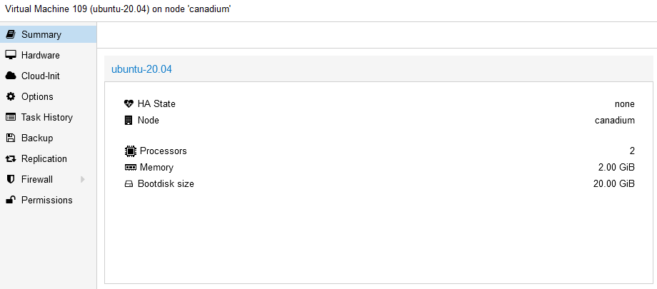
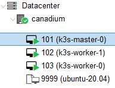

# Architecture

I'm preparing for the Certified Kubernetes Administrator (CKA) and I needed a lab to practice. I've done quite a bit of standard Kubernetes in lab environments through Udemy courses and I wanted to try something different but still K8S-based.
I looked into K3S from Rancher. It has several qualities that seem interesting to me:
- It is lighter and faster than K8s
- It can run on smaller hardware (ARM processors for example 🥰). I have a potential project to build a Raspberry Pi cluster so K3S is more than suitable.
- It doesn't have all the cloud connectors but since it will be "on premise" in my case that's perfect.
- Lots of small advantages: easier and faster to deploy, smaller attack surface, easy to update, etc.

On the other hand it doesn't run docker natively but containerd (although I came across a project called k3d that integrates docker) — it will be an opportunity to learn something different, especially since the CRI (Container Runtime Interface) itself is not the most important thing to me.

Once I had chosen my orchestrator I decided to install my K3s cluster on my home lab running Proxmox, and while I was at it I might as well have a more advanced deployment workflow to practice with.

Among all the resources I found, the workflow that seemed most interesting at first did the following:
- Downloading the Ubuntu 20 ISO on Proxmox
- Creating the Proxmox template "by hand" via qm commands (Proxmox CLI)
- Configuring cloud init via the dedicated Proxmox tab
- Creating VMs via Terraform
- Ansible to deploy K3s on the new VMs

It looked good on paper and allowed me to apply the Terraform knowledge I had.
But thinking about it more carefully there were still two problems with this process:
- A manual part that somewhat broke the desired automation. If I could automate this I would truly be in an IaC (**Infrastructure As Code**) scenario
- Not very flexible because if I want to customize my template it would also be done manually or at best via a bash script

That's when I came across another Hashicorp tool that does all this manual work for me and has the desired flexibility: Packer!

</br>Here are the two workflows that emerged in the end:

- Template creation --> Cloud init --> Terraform --> Ansible --> K3S  
- **Packer (+Cloud init) --> Terraform --> Ansible --> K3S**

I therefore chose the second workflow  
Advantages:
- Infrastructure as code - Fully automated
- No direct interaction with Proxmox, only via its API
- Can therefore be driven from a third-party machine

⚠️ Disadvantages:
- Requires more development and time for an equivalent result in my case (setting up a potential DHCP, creating the packer config file, etc.)
- Longer template creation execution time

Find the entire project on this git: https://github.com/ramuskay/k3s-proxmox-terraform-ansible-packer

# Packer

I'm going to use Packer to package my Ubuntu 20.04 image with some additional packages and configurations. Simply install [packer](https://www.packer.io/downloads) then we'll look at the configuration files.  
In my case no DHCP is needed — the one from my router with my template VM in bridge mode will be more than sufficient.  
Here is my Packer folder structure for the config:
```
├── http
│   ├── meta-data
│   └── user-data
├── ubuntu20.pkr.hcl
└── variables.pkr.hcl
```

The config files can be in JSON or HCL (HashiCorp format). I chose HCL over JSON for two reasons:
- Common language across all HashiCorp tools (since we'll also be using Terraform it makes sense)
- More "functional" — you can add comments for example (which you can't in JSON as it would always be part of the data)

We therefore have 2 HCL files covering:
- `variables.pkr.hcl`: the definition of default variables
- `ubuntu20.pkr.hcl`: the definition of the Packer job

Let's look at `ubuntu20.pkr.hcl` in more detail:

```ruby
source "proxmox" "template" {
  proxmox_url = "${var.proxmox_hostname}/api2/json"
  username = var.proxmox_username
  password = var.proxmox_password
  node = var.proxmox_node_name
  insecure_skip_tls_verify = var.proxmox_insecure_skip_tls_verify
  network_adapters {
    bridge = "vmbr0"
  }
  disks {
    type = "scsi"
    disk_size = "20G"
    storage_pool = var.vm_storage_pool
    storage_pool_type = "lvm"
  }
  #iso_file = "local:iso/ubuntu-20.04.4-live-server-amd64.iso"
  iso_url               = var.iso_url
  iso_storage_pool      = var.iso_storage_pool
  iso_checksum          = var.iso_checksum
  unmount_iso = true
  boot_wait = "5s"
  memory = var.vm_memory
  sockets   = var.vm_sockets
  cores     = var.vm_cores
  template_name = var.vm_name
  vm_id     = var.vm_id
  http_directory = var.http_directory
  cloud_init = true
  cloud_init_storage_pool = var.iso_storage_pool
  boot_command = [
    "<esc><wait><esc><wait><f6><wait><esc><wait>",
    "<bs><bs><bs><bs><bs>",
    "autoinstall ds=nocloud-net;s=http://{{ .HTTPIP }}:{{ .HTTPPort }}/ ",
    "--- <enter>"
  ]
  ssh_username = var.username
  ssh_password = var.user_password
  ssh_timeout = "20m"
}

build {
  sources = [
    "source.proxmox.template"
  ]
  provisioner "shell" {
    inline = [
      "sudo rm -f /etc/cloud/cloud.cfg.d/99-installer.cfg",
      "sudo rm -f /etc/cloud/cloud.cfg.d/subiquity-disable-cloudinit-networking.cfg",
      "sudo cloud-init clean"
    ]
  }
}
```
Nothing too complicated here — this is also generally the advantage of HashiCorp tools: the configuration is very descriptive and therefore quickly understandable.
We will fill in the following information:
- Credentials for Proxmox
- Some hardware specs for the template (RAM, CPU, Disk, etc.)
- A config for the template (ID, name, boot command, SSH credentials, etc.)
- A folder for the Subiquity config
- **We enable cloud-init because otherwise we can't set IPs via Terraform**
- We tweak the image a bit because we want it to be cloud-init ready

Speaking of autoinstall — since version 20.04, preseed has been replaced by Subiquity which is (in my view) much easier to use as it uses YAML format and integrates very well with Packer. This gives us two files:
- `meta-data`: required. Used by the cloud — since we're deploying locally we leave it empty
- `user-data`: the equivalent of preseed, uses autoinstall

The `user-data` file in detail:
```yml
#cloud-config
autoinstall:
  version: 1
  locale: en_US
  keyboard:
    layout: us
  ssh:
    install-server: true
    allow-pw: true
  packages:
    - qemu-guest-agent
  user-data:
    users:
        - name: canadium
          passwd: $6$exDY1mhS4KUYCE/2$zmn9ToZwTKLhCw.b4/b.ZRTIZM30JZ4QrOQ2aOXJ8yk96xpcCof0kxKwuX1kqLG/ygbJ1f8wxED22bTL4F46P0
          groups: [adm, cdrom, dip, plugdev, sudo]
          lock-passwd: false
          sudo: ALL=(ALL) NOPASSWD:ALL
          shell: /bin/bash
          ssh_authorized_keys:
            - ssh-ed25519 AAAAC3NzaC1lZDI1NTE5AAAAIJEXrwiuUOCpWPvwOsGuF4K+aq1ufToGMi4ra/1omOZb
```

An extremely basic configuration file — we define a single user and two system configs. Other options can be found in the [docs](https://ubuntu.com/server/docs/install/autoinstall-reference)  
⚠️ This file is "templated" and redefined via Terraform, see below

We can then run Packer via Terraform to have a single unified execution.  
This gives us a quality template!


# Terraform

We now need to deploy our template as VMs — we'll use Terraform as our main tool. **Everything** will go through Terraform:
- Creating config files for Packer, Ansible, and Terraform
- Running Packer
- Running Terraform of course
- Running Ansible

Install [Terraform](https://learn.hashicorp.com/tutorials/terraform/install-cli?in=terraform/aws-get-started) then let's tackle the configuration files:
```
├── main.tf
├── output.tf
├── provider.tf
├── terraform.tfvars
└── variables.tf
```

Let's list the Terraform files:
- `main.tf`: We describe our deployment — the job file.
- `output.tf`: The desired output when running Terraform apply (we'll print the IPs here)
- `provider.tf`: We specify which provider we use, here Proxmox. (see [docs](https://registry.terraform.io/providers/Telmate/proxmox/latest/docs))
- `terraform.tfvars`: the variable definitions for main.tf (same principle as Packer)
- `variables.tf`: the default variable definitions (same principle as Packer)

And we have template files that will let us define our Ansible inventory, Ansible group_vars, autoinstall user-data, etc.

I'll just describe the main.tf file as the others are fairly self-explanatory.
We define the variables for the future Packer execution:

```ruby
locals {
  template_folder = "${path.module}/${var.folder_packer}/${var.distrib_folder}"
  packer_cfg = {
    PKR_VAR_proxmox_hostname  = var.pm_host
    PKR_VAR_proxmox_username  = var.pm_user
    PKR_VAR_proxmox_password  = var.pm_password
    PKR_VAR_proxmox_node_name = var.pm_node_name
    PKR_VAR_proxmox_insecure_skip_tls_verify = var.pm_tls_insecure

    PKR_VAR_vm_id                 = var.vm_id
    PKR_VAR_vm_name               = var.vm_name
    PKR_VAR_vm_storage_pool       = var.vm_storage_pool
    PKR_VAR_vm_cores              = var.vm_cores
    PKR_VAR_vm_memory             = var.vm_memory
    PKR_VAR_vm_sockets            = var.vm_sockets

    PKR_VAR_iso_url             = var.iso_url
    PKR_VAR_iso_storage_pool    = var.iso_storage_pool
    PKR_VAR_iso_checksum        = var.iso_checksum

    PKR_VAR_http_directory      = var.http_directory

    PKR_VAR_username              = var.username
    PKR_VAR_user_password         = var.user_password
  }
}
```
Here we define the Packer job with all the desired parameters (ultimately it's a standard shell execution).  
I added a small sleep because sometimes the template wasn't ready for the Terraform execution. Also a Python script to delete the template created by Packer (no native resource so we have to "hack" it):
```ruby
resource "null_resource" "packer_build" {
    provisioner "local-exec" {
    working_dir = local.template_folder
    command     = "packer build . && sleep 30"
    environment = local.packer_cfg
  }
  provisioner "local-exec" {
    when  = destroy
    command = "${path.module}/scripts/delete_template.py"
    interpreter = ["python"]
    working_dir = path.module
    environment = merge(yamldecode(self.triggers.packer_cfg))
  }
    triggers = {
    packer_cfg = yamlencode(local.packer_cfg)
  }
  depends_on = [
    local_file.user-data
  ]
}
```

We redefine a K3S master on top of our template (var.template_vm_name). Note that we need to specify a dependency so that tasks execute in the right order. Also note a shell script that will verify that the cloud-init deployment is fully finished on the server:
```ruby
resource "proxmox_vm_qemu" "proxmox_vm_master" {
  count       = var.num_k3s_masters
  name        = "k3s-master-${count.index}"
  target_node = var.pm_node_name
  clone       = var.template_vm_name
  os_type     = "cloud-init"
  agent       = 1
  memory      = var.num_k3s_masters_mem
  cores       = var.num_k3s_masters_cpu

  ipconfig0 = "ip=${var.master_ips[count.index]}/${var.networkrange},gw=${var.gateway}"

  lifecycle {
    ignore_changes = [
      ciuser,
      sshkeys,
      disk,
      desc,
      network
    ]
  }

  connection {
    type = "ssh"
    user = var.username
    password = var.user_password
    host = var.worker_ips[count.index]
  }

  provisioner "file" {
    source      = "${path.module}/scripts/wait-cloud-init.sh"
    destination = "/tmp/wait-cloud-init.sh"
  }

  provisioner "remote-exec" {
    inline = [
      "chmod +x /tmp/wait-cloud-init.sh",
      "/tmp/wait-cloud-init.sh",
    ]
  }
  depends_on = [
    null_resource.packer_build
  ]
}
```

We'll do the same task for the workers.

And here we define our configuration customization tasks, namely:
- Generate configuration files for the future Ansible execution
- Generate the user-data needed for Packer's autoinstall (we mainly modify the user/password)

```ruby
data "template_file" "cloud-init-user-data" {
    template = "${file("${path.module}/templates/user-data.tpl")}"
    vars = {
        SUDO_PASSWORD_HASH = "${var.user_password_hash}"
        SUDO_USERNAME = "${var.username}"
        SSH_PUBLIC_KEY = "${var.ssh_pub_key}"
    }
}
resource "local_file" "user-data" {
    content     = "${data.template_file.cloud-init-user-data.rendered}"
    filename = "${local.template_folder}/http/user-data"
}

data "template_file" "k8s" {
  template = file("./templates/k8s.tpl")
  vars = {
    k3s_master_ip = "${join("\n", [for instance in proxmox_vm_qemu.proxmox_vm_master : join("", [instance.default_ipv4_address, " ansible_ssh_private_key_file=", var.pvt_key])])}"
    k3s_node_ip   = "${join("\n", [for instance in proxmox_vm_qemu.proxmox_vm_workers : join("", [instance.default_ipv4_address, " ansible_ssh_private_key_file=", var.pvt_key])])}"
  }
}

resource "local_file" "k8s_file" {
  content  = data.template_file.k8s.rendered
  filename = "${path.module}/ansible/hosts"
}

data "template_file" "groups_vars_ansible" {
    template = "${file("${path.module}/templates/all.tpl")}"
    vars = {
        ANSIBLE_USER = "${var.username}"
        K3S_VERSION = "${var.k3s_version}"
    }
}

resource "local_file" "groups_vars_ansible" {
    content     = "${data.template_file.groups_vars_ansible.rendered}"
    filename = "${path.module}/ansible/group_vars/all.yml"
}
```
And finally the Ansible job:

```ruby
resource "null_resource" "ansible-playbook" {
  provisioner "local-exec" {
    command = "ansible-playbook -i ${var.inventory_file}  --private-key ${var.ssh_key_file} site.yml"
    working_dir = ".."
  }
  depends_on = [
    proxmox_vm_qemu.proxmox_vm_workers,
    proxmox_vm_qemu.proxmox_vm_master,
    local_file.k8s_file,
    local_file.var_file
  ]
}
```

# Ansible

The K3S cluster is deployed via Ansible. Here is the folder structure:
```
ansible/
├── ansible.cfg
├── group_vars
│   └── all.yml
├── playbook.yml
└── roles
    ├── download
    │   └── tasks
    │       └── main.yml
    ├── k3s
    │   ├── master
    │   │   ├── tasks
    │   │   │   └── main.yml
    │   │   └── templates
    │   │       ├── k3s.service.j2
    │   │       └── k3s.service.j2.withoutterafic
    │   └── node
    │       ├── tasks
    │       │   └── main.yml
    │       └── templates
    │           └── k3s.service.j2
    ├── postconfig
    │   └── localhost
    │       └── tasks
    │           └── main.yml
    ├── prereq
    │   ├── defaults
    │   │   └── main.yml
    │   ├── tasks
    │   │   └── main.yml
    │   └── templates
    │       └── resolv.conf.j2
    ├── raspberrypi
    │   ├── handlers
    │   │   └── main.yml
    │   └── tasks
    │       ├── main.yml
    │       └── prereq
    │           ├── CentOS.yml
    │           ├── Raspbian.yml
    │           ├── Ubuntu.yml
    │           └── default.yml
```

Here are the different roles:
- `download`: Downloads the K3s release
- `k3s`: The K3s configuration for the master and nodes (nothing too complicated)
- `postconfig`: Configures kubeconfig and installs Helm locally on the server/workstation running the Ansible job
- `prereq`: Installs K3S prerequisites (netfilter, IP forwarding, etc.)
- `raspberrypi`: A specific job if running on Raspberry Pi

Notes:
- The group vars all.yml file is generated via Terraform from variables
- The ansible.cfg file can be configured to your liking


# Conclusion
We have created a K3s cluster from scratch with no direct or manual interaction with Proxmox — not bad right? On top of that everything is dynamic and flexible, you just need to change the config 😉




You can reuse this [project](https://github.com/ramuskay/k3s-proxmox-terraform-ansible-packer) (which is itself forked). For usage instructions everything is explained in the [README](https://github.com/ramuskay/k3s-proxmox-terraform-ansible-packer/blob/main/terraform/README.md) and mainly consists of changing Terraform variables.

Despite all this there are quite a few areas for improvement and problems inherent to the chosen solution:
- We could store sensitive variables in Vault (HashiCorp tool) and a git that redeploys a Packer image on each push.
- We should also create appropriate users (Terraform & Packer) with the right permissions — see the [Terraform](https://registry.terraform.io/providers/Telmate/proxmox/latest/docs) resource for example.  
- The Packer job should finish at the right moment so the Terraform job doesn't start too early (I currently have a sleep 30 in place)  
- No native Packer provider so we have to "cheat" to delete the template
- Terraform considers on a second run that nothing has changed and doesn't re-run the Ansible job (you can still run it manually)

In short there are plenty of other ways to do and improve this pipeline — HashiCorp tools are really great for that!

# Sources

https://www.aerialls.eu/posts/ubuntu-server-2004-image-packer-subiquity-for-proxmox/  
https://tlhakhan.medium.com/ubuntu-server-20-04-autoinstall-2e5f772b655a  
https://stackoverflow.com/questions/72567455/running-cloud-init-twice-via-packer-terraform-on-vmware-ubuntu-22-04-guest  
https://salmonsec.com/blogs/home_lab_3#6-init-kubeadm-images-sh  
https://github.com/blz-ea/proxmox-packer  
https://medium.com/@ssnetanel/build-a-kubernetes-cluster-using-k3s-on-proxmox-via-ansible-and-terraform-c97c7974d4a5