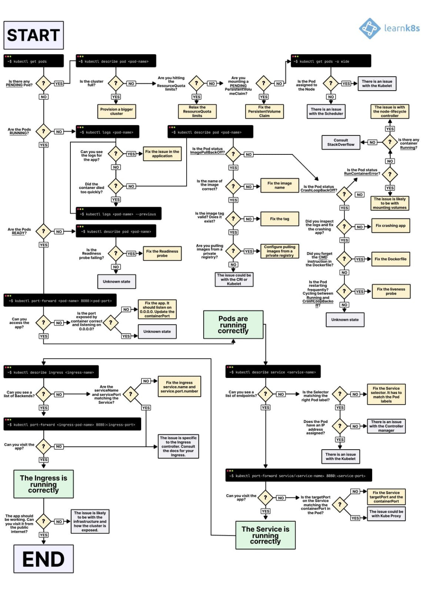

Mon entreprise a pu cette année me financer la Certified Kubernetes Administrator (CKA), obtenue avec succès il y a quelques jours c'est l'occasion pour moi de faire un petit retour d'expérience !

# Contexte

Tout d'abord il faut savoir qu'il n'existe que 4 certifications Kubernetes officielles :
- Kubernetes and Cloud Native Associate (KCNA)
- Certified Kubernetes Application Developer (CKAD)
- Certified Kubernetes Administrator (CKA)
- Certified Kubernetes Security Specialist (CKS)

Celle qui correspond le plus à mon profil et ce que je sais faire est la CKA.
Elle coûte environ 400$ et possède les avantages suivants :
- Un certain nombre de ressources sur Kubernetes (rien d'exceptionnel)
- Deux examens blancs (identiques cependant) pour se préparer
- Des accès à des plateformes d'entrainement et de scénario divers
- L'accès à certification en elle-même

Afin d'obtenir la certification il "suffit" d'avoir 66% de réponse correcte le jour de l'examen.  
Les réponses ne sont pas de type QCM mais plus en mode TP, il faut "réaliser" l'exercice sur un environnement Kubernetes.  
L'examen se décompose de la façon suivante :
- Storage 10%
- Troubleshooting 30%
- Workloads & Scheduling 15%
- Cluster Architecture, Installation & Configuration 25%
- Services & Networking 20%

# Se préparer

Etant donné que je n'ai jamais eu de réelle expérience professionnelle de Kubernetes je n'ai pas pris cette certification à la légère, j'ai acheté deux formations sur Udemy pour préparer cet examen :
- Certified Kubernetes Administrator (CKA) with Practice Tests (~13€)
- Kubernetes for the Absolute Beginners (~13€)

Ces formations comprennent :
- Les cours en vidéo de 3 à 20 minutes chacune
- Des résumés PDF des chapitres étudiés (honnêtement pas terrible les PDF)
- Accès à une plateforme d'entrainement scénarisée selon les chapitres
- Quelques examens blancs (ne représente pas les conditions de l'examen cependant)

Franchement je n'attendais pas grand-chose de ces formations notamment par rapport au prix investi mais j'ai vraiment été agréablement surpris ! (Comme quoi ne pas juger une formation en fonction du prix).  
Par contre si j'avais su je n'aurais peut-être pas pris la formation "Kubernetes for the Absolute Beginners" qui est reprise en entier ou presque dans la formation "Certified Kubernetes Administrator (CKA) with Practice Tests".  

Pour ceux qui ne veulent pas débourser de l'argent pour cela je conseille les vidéos de Xavki sur YouTube dans la playlist Kubernetes. Elle ne prépare pas en tant que tel pour la certification mais ses vidéos sont vraiment de qualité et vont plus loin que le périmètre de la certification.

Ensuite je conseille les liens suivants qui m'ont été utile pour fignoler ma préparation :
- https://kubernetes.io/docs : fait partie des rares sites autorisés le jour de l'examen, je conseille de bien s'approprier le site afin de perdre le moins de temps possible le jour J.
- https://docs.linuxfoundation.org/tc-docs/certification/tips-cka-and-ckad : concerne les détails pratique de l'examen (comment cela se passe, la plateforme utilisé etc...)
- https://github.com/StenlyTU/K8s-training-official : un repo d'exercices en lien avec les topics CKA

Je conseille plus que vivement d'utiliser la plateforme d'examen blanc fourni par le site killer.sh  
Elle propose des conditions d'examen **identiques** et permet donc d'avoir une première approche de ce qu'il sera proposé le jour J.  
Personnellement je n'ai eu que 75/125 soit seulement 60% donc en dessous des 66% demandé. MAIS :
- Les questions sont plus difficiles que celles du vrai examen
- Elles sont également plus nombreuses (25 au lieu de 17) pour le même temps (2h)

En lisant quelques sub reddit je me suis rendu compte que je n'étais pas seul dans ce cas et que 75pts restait finalement un bon score.


Enfin voici quelques conseils que j'ai pu trouver ici et là sur internet.  
Ajouter des variables bash pour aller plus vite :
```
export do="--dry-run=client -o yaml"
export now="--force --grace-period 0"
```

Ces deux variables peuvent être ajoutées à la fin des commandes kubectl pour créer un fichier ou supprimer un pod plus rapidement.  
Ex: `kubectl run nginx --image nginx $do > pod.yml`  

Bien étudier ce workflow qui détaille comment troubleshoot une partie des ressources K8S, cela représente 30% de la note tout de même :


# L'examen en lui même

Une fois qu'une date sera choisie il faudra respecter les conditions suivantes le jour J :
- Avoir une webcam (externe ou interne)
- Avoir une pièce d'identité non expirée (permis de conduire, passeport, CNI etc...)
- Être dans une pièce isolée où être seul et au calme

Bien vérifier également que la webcam puisse filmer la pièce d'identité **distinctement** (c'est très important !).  

Il faut se connecter jusqu'à 30min avant, une fois cela fait il sera possible de télécharger un logiciel qui fera office de plateforme d'examen (attention 300Mo dans mon cas).  
Une fois téléchargé et installé il faudra prendre une photo de soi-même via la webcam et une photo de notre pièce d'identité, cela enclenchera la vérification par un instructeur.  
La vérification dans mon cas n'a pas duré très longtemps, cela effectué l'instructeur demandera de filmer la pièce afin de vérifier que tout est ok et qu'il n'y a rien d'interdit à proximité.  
Dans mon cas on m'a demandé de poser mon téléphone dans le champ de la caméra mais hors de portée et d'enlever le plastique de ma bouteille d'eau !
Lorsque toutes ces vérifications sont terminées on peut enfin commencer l'examen ! Comme vu précédemment l'environnement est exactement le même que killer.sh mais en plus simple.  
A part un ou deux écueils je n'ai pas trouvé l'examen très complexe.

On obtient le résultat au bout de 24h max, pour moi j'ai réussi à l'obtenir avec 83% donc ça passe 🙂

# Conclusion

Je doutais un peu que la certification m'apporte réellement quelque chose mais finalement afin de l'obtenir je me suis vraiment investi et cela m'a apporté des connaissances théoriques sur la techno.  
Cela me donne un véritable vernis de base lorsqu'il sera question de Kubernetes.

Ceci dit cela ne remplacera jamais l'expérience "sur le terrain" selon moi et la certification ne vient qu'en complément. J'ai donc hâte de pouvoir mettre en pratique les connaissances acquises ! 🤞