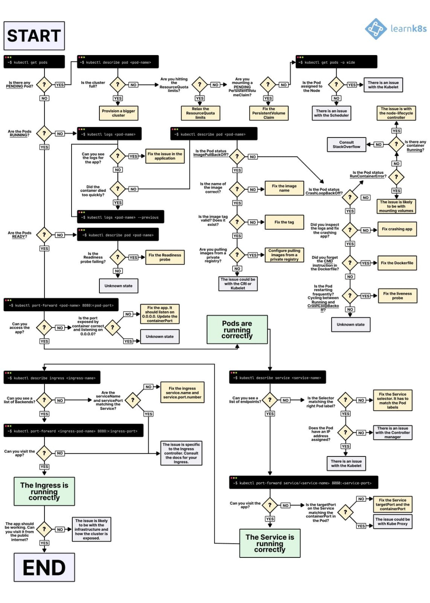

My company was able to fund the Certified Kubernetes Administrator (CKA) for me this year. Having passed it successfully a few days ago, it's a good opportunity to share my experience!

# Context

First of all, it's worth knowing that there are only 4 official Kubernetes certifications:
- Kubernetes and Cloud Native Associate (KCNA)
- Certified Kubernetes Application Developer (CKAD)
- Certified Kubernetes Administrator (CKA)
- Certified Kubernetes Security Specialist (CKS)

The one that best matches my profile and skill set is the CKA.
It costs around $400 and comes with the following:
- A number of Kubernetes resources (nothing exceptional)
- Two mock exams (identical though) to prepare
- Access to training platforms and various scenario labs
- Access to the certification itself

To obtain the certification you "simply" need to score 66% correct answers on exam day.  
The answers are not multiple choice but more hands-on — you need to "complete" the exercise on a Kubernetes environment.  
The exam breaks down as follows:
- Storage 10%
- Troubleshooting 30%
- Workloads & Scheduling 15%
- Cluster Architecture, Installation & Configuration 25%
- Services & Networking 20%

# Preparing

Since I never had any real professional experience with Kubernetes I didn't take this certification lightly — I bought two courses on Udemy to prepare for this exam:
- Certified Kubernetes Administrator (CKA) with Practice Tests (~20$)
- Kubernetes for the Absolute Beginners (~20$)

These courses include:
- Video lessons ranging from 3 to 20 minutes each
- PDF summaries of the studied chapters (honestly not great)
- Access to a scenario-based training platform organized by chapter
- A few mock exams (though they don't replicate actual exam conditions)

Honestly I wasn't expecting much from these courses given the price, but I was genuinely pleasantly surprised! (Goes to show you shouldn't judge a course by its price.)  
That said, had I known, I might not have bought the "Kubernetes for the Absolute Beginners" course since it is almost entirely covered in the "Certified Kubernetes Administrator (CKA) with Practice Tests" course.

For those who don't want to spend money on this, I recommend Xavki's videos on YouTube in the Kubernetes playlist. It doesn't prepare you specifically for the certification but the videos are really high quality and go beyond the certification scope.

Here are some links that were useful to me for polishing my preparation:
- https://kubernetes.io/docs : one of the few sites allowed on exam day — I strongly recommend getting familiar with it to lose as little time as possible on the day.
- https://docs.linuxfoundation.org/tc-docs/certification/tips-cka-and-ckad : covers the practical details of the exam (how it works, the platform used, etc.)
- https://github.com/StenlyTU/K8s-training-official : a repository of exercises related to CKA topics

I highly recommend using the mock exam platform provided by killer.sh.  
It offers **identical** exam conditions and gives you a first taste of what will be presented on the day.  
Personally I only scored 75/125, which is 60% — below the required 66%. BUT:
- The questions are harder than those in the real exam
- There are also more of them (25 instead of 17) for the same duration (2h)

Reading a few subreddits I realized I wasn't alone in this situation and that 75 points was actually a decent score.


Finally, here are a few tips I found here and there online.  
Add bash variables to work faster:
```
export do="--dry-run=client -o yaml"
export now="--force --grace-period 0"
```

These two variables can be appended to kubectl commands to create a file or delete a pod more quickly.  
Ex: `kubectl run nginx --image nginx $do > pod.yml`  

Study this workflow carefully — it details how to troubleshoot some K8s resources, which accounts for 30% of the score:


# The exam itself

Once a date has been chosen, you will need to meet the following conditions on exam day:
- Have a webcam (external or built-in)
- Have a non-expired ID (driver's license, passport, national ID card, etc.)
- Be in an isolated room, alone and in a quiet environment

Also make sure the webcam can film your ID **clearly** (this is very important!).  

You need to connect up to 30 minutes before, after which you will be able to download a piece of software that serves as the exam platform (note: 300MB in my case).  
Once downloaded and installed you will need to take a photo of yourself via the webcam and a photo of your ID, which will trigger verification by a proctor.  
In my case the verification didn't take very long — once done, the proctor will ask you to film the room to verify everything is in order and that there is nothing prohibited nearby.  
In my case I was asked to place my phone in the camera's field of view but out of reach, and to remove the plastic wrapper from my water bottle!  
Once all these checks are complete you can finally start the exam! As mentioned earlier the environment is exactly the same as killer.sh but simpler.  
Apart from one or two hiccups I didn't find the exam very complex.

You get the result within 24 hours at most — I passed with 83%, so all good 🙂

# Conclusion

I had some doubts about whether the certification would really bring me anything, but in the end the effort I put in to obtain it gave me solid theoretical knowledge of the technology.  
It gives me a genuine foundation when it comes to Kubernetes.

That said, in my opinion it will never replace real hands-on experience, and the certification is only a complement. So I'm eager to put the acquired knowledge into practice! 🤞