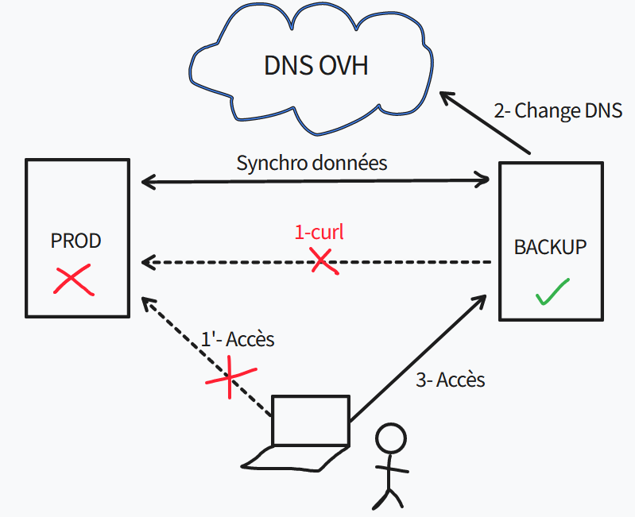
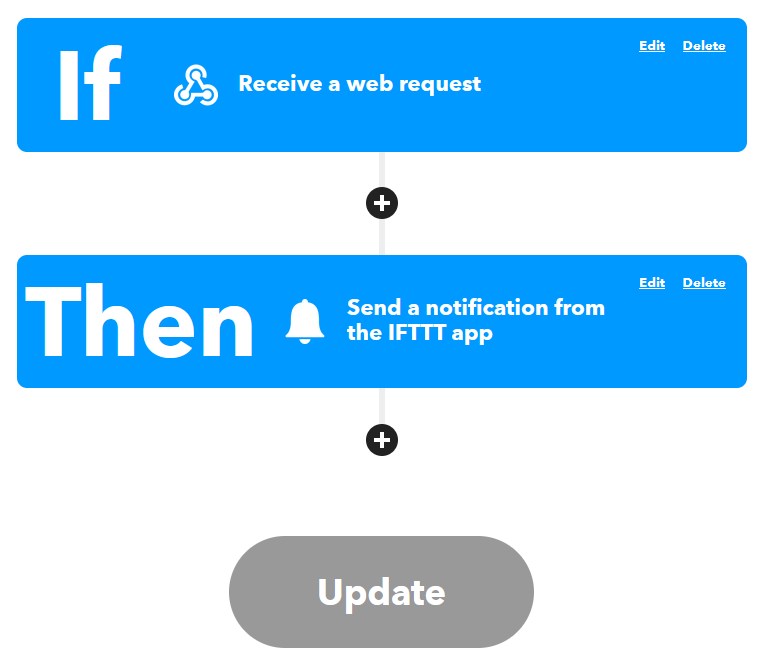

# Contexte

Mon serveur hébergé a des petits soucis en ce moment, il a tendance à planter régulièrement malgré le fait que je le supervise activement.  
J'ai très longtemps pensé que c'était l'un de mes containers docker qui s'emballait (malgré le fait qu'il y ait des options de runtime de paramétrées) mais il s'avère que c'est le metrics scraper d'OVH installé qui posait problème !  
Bref avant de résoudre le problème, mes services hébergés ne répondaient plus de temps en temps et cela reste tout de même très embêtant. Il a donc fallu que je pense à une potentielle redondance !

# Etude des solutions

Il fallait donc que je trouve une solution pour avoir les sites les plus importants toujours en fonction en cas de défaillance majeure de mon serveur dédié le temps que je trouve une solution à long terme. Pour simplifier la problématique je ne souhaite basculer qu'un seul site pour le moment car il est consulté fréquemment pour des raisons professionnelles, les autres n'ont pas d'importance cruciale.

J'ai les équipements suivants avec moi :
- Une IP publique dédiée d'OVH
- Un serveur hébergé chez OVH
- Un micro serveur avec des ressources équivalentes de celle d'OVH chez moi
- La fibre et une IP publique dynamique (celle de ma box)

Voici les quelques techniques auxquelles j'ai pensé en premier lieu :

- Backup, Replica
- Cluster
- Solution de fail over

La solution **backup/réplica** a tout de suite été écartée du fait qu'elle ne soit pas du tout flexible. Je fais déjà du backup de mon serveur vers chez moi mais c'est cela concerne plus la conf de mon dockerfile et les datas de certains containers mais rien qui ne me permet de remonter une infra en 10min automatiquement (surtout pour une solution censée rester temporaire).  
Pour le **cluster** ça serait la solution idéale, dans mon cas passer sous Docker Swarm ou encore mieux tout migrer sous K8s/K3s. Le problème est que je veux une solution rapide à mettre en place ne necessitant pas une refonte complète de mon infra. D'autant plus que je n'ai pas du tout réfléchi à la conception de ma future infra et comment cela est géré avec une IP publique dynamique.  
La dernière proposition est surement la plus adaptée pour moi, trouver une **solution de failover** simple et efficace avec le moins d'intervention humaine sans toucher à la configuration déjà en place.

Une fois choisie il a fallu que je compare les solutions avec les contraintes suivantes :
- Une bascule faite en 5 minutes max en cas de problème.
- L'ensemble des données doivent être identique et synchronisé (si modification d'un fichier html réplication immédiate sur le backup).
- Rapide et simple à mettre en place, pas de service payant etc...

Après un moment de réflexion voici le workflow imaginé :



Le détail des flux serait donc le suivant :
- Problème sur la production (serveur OVH) qui rend le site web indisponible
- Un script sur le serveur backup vérifie régulièrement la disponibilité du site web
- Le script constate l'indisponibilité et via les API OVH change l'IP publique du site en question en la faisant pointer sur le serveur de backup lui-même
- Avec un TTL assez faible (60), l'utilisateur devrait avoir accès au site web via le backup

Il reste le sujet de la synchronisation des données, solutions possibles :
- Un montage sur le dossier du site web en question
- Un rsync depuis le backup vers la prod à une fréquence régulière
- Un rsync depuis la prod vers le backup dès qu'un fichier est modifié

J'ai passé pas mal de temps sur ces solutions car elles ont toutes leurs problèmes :
- **Montage** : Aucun intérêt car si la prod plante je n'ai plus de montage et donc plus de donnée, il faut forcément une copie. Je peux toujours par la suite via un cron faire une copie régulière des données en local mais aucun intérêt par rapport aux autres solutions.
- **Rsync depuis le backup** : Pas trop fan de créer des accès sur mon serveur de prod même si c'est du rsync via clé SSH sur un user non root. Mais surtout comment je détecte qu'un fichier a changé ou été créé ? Seule la prod peut avoir ses infos. J'ai tout de même essayé de créer un montage sshfs avec une surveillance du dossier via l'outil inotify mais cela ne marche pas du tout ensemble, inotify fonctionne avec un système de fichier local.
- **Rsync depuis la prod** : Dernière solution, celle-ci parait la plus "faisable" la prod surveillant ses fichiers via inotify ou un autre outil et rsync en cas de changement. Par contre avec l'IP dynamique je suis toujours "bloqué" car à chaque redémarrage de ma box je change d'IP. J'ai donc dû faire appel à un service type DynDNS, ma box ne gérant que DynDNS ou NoIP j'ai choisi ce dernier qui a une version freemium (il faut valider manuellement le domaine tous les mois sinon 5€/mois...)

# Mise en place

J'ai 4 parties à mettre en place :
- Le script de vérification de la disponibilité du site web.
- Le script de changement du DNS.
- L'outil qui va permettre la synchro des données de la prod vers le backup.
- Des petits scripts annexes pour alerter en cas de défaillance de la prod/backup.

Toute la partie scripting va être condensée dans un seul et même script

## Partie scripting

```
from urllib.request import urlopen, Request
from urllib.error import HTTPError, URLError
import sys
import time
import requests
import dns.resolver
import ovh

new_ip = requests.get('https://api.ipify.org').content.decode('utf8') #Dynamic public IP
domain = "beerus.fr"
site_name = "<the_website_to_monitor>"
ifttt_event = "<event_ifttt_name>" #See https://ifttt.com
ifttt_key = "<event_ifttt_key>" #See https://ifttt.com
ovh_secret = "<ovh_secret>" #See https://docs.ovh.com/ca/fr/api/first-steps-with-ovh-api/
ovh_key = "<ovh_key>" #See https://docs.ovh.com/ca/fr/api/first-steps-with-ovh-api/
ovh_consumer = "<ovh_consumer>" #See https://docs.ovh.com/ca/fr/api/first-steps-with-ovh-api/

# setting the URL you want to monitor
URL = Request("https://{0}.{1}".format(site_name, domain),
              headers={'User-Agent': 'Mozilla/5.0'})
i = 0

#Verify status of the DNS
result = dns.resolver.query(site_name, 'A')
for ipval in result:
    if ipval.to_text() == new_ip:
        print("Already switched")
        sys.exit(0)

#The site is answering ?
while i < 10:
    time.sleep(5)
    print(URL.full_url)
    try:
        response = urlopen(URL, timeout=2)
    except (HTTPError, URLError) as error:
        i = i+1
        continue
    if response.status == 200:
        print("Prod is okay")
        break
    i = i+1

#The website is down so we can switch and alert
if i == 10:
    response = requests.post('https://maker.ifttt.com/trigger/{0}/with/key/{1}'.format(ifttt_event, ifttt_key))
    client = ovh.Client(
        endpoint='ovh-eu',
        application_key=ovh_key,
        application_secret=ovh_secret,
        consumer_key=ovh_consumer,
    )

    result = client.put(
        '/domain/zone/{0}/record/5206233547'.format(domain),
        subDomain=site_name,
        target=new_ip,
        ttl=60,
    )

    result = client.post('/domain/zone/{0}/refresh'.format(domain))
```

Le script ci-dessus a été passé en cron sur le serveur backup et est exécuté toutes les 10 minutes.  
Il exécute les actions suivantes :
- Vérification du DNS (le site a-t-il déjà basculé ?)
- Curl vers le site en question, 10 tests avec un intervalle de 5s
- Si down bascule vers le backup via les API d'OVH
- Notification (on verra ça dans une autre partie)

## Synchronisation données

Pour la synchro j'avais dans un premier temps pensé à inotify avec rsync.  
Il aurait suffi de lancer le binaire (via systemd dans l'idéal) et dès lors qu'il aurait remarqué un event qui match avec les options précisées (create, delete, move etc...) il effectuerait un rsync.  
Le problème étant que cela nécessite pas mal de bricolage (script, création d'un systemd etc...) et j'aurais aimé en éviter le plus possible.
Heureusement je suis tombé sur l'outil **lsyncd** qui fait exactement ce travail, pas besoin de réinventer la roue !
En plus il peut se baser sur rsync pour faire ses actions ce qui est parfait pour moi. J'ai fait deux configurations :
- Une pour le webroot de mon site, en cas de modification/ajout/suppression lsyncd exécute un rsync immédiatement vers mon backup
- Une pour le dossier des certificats de mon site web, étant donné que je suis sous LetsEncrypt les certificats sont renouvelés régulièrement. De la même façon dès qu'il y a une modification de ceux-ci (le certificat public à priori) il copie le nouveau certificat sur le backup

Tous cela est parfait mais il me manque encore la partie SSH pure car mon serveur backup est hébergé chez moi derrière ma box. J'utilise déjà le port 22 pour d'autres usages donc il va falloir faire de la configuration additionnelle.  
J'avais deux possibilités :
- Je fais un NAT sur un port différent du 22 (du style IP_PUB:2222 --> backup:22)
- Je fais un bastion SSH avec un hardenning et qui forward mes requêtes vers mon backup

J'ai décidé de faire la deuxième solution, ça permet de s'entrainer sur quelque chose que je n'ai pas l'habitude de faire 🙂. Je passe la partie hardenning car ce n'est pas ce que j'ai envie d'aborder dans ce post mais ça consiste à faire les choses suivantes (non exhaustives) :
- Fail2ban
- No PermitRoot
- Authentification par clé uniquement
- Un Jail chroot avec un nombre de binaire limité (adios su et sudo 😈)

Par rapport au bastion, 3 solutions pour faire ce jump :
- Stockage des clés SSH sur le bastion
- Forwarding SSH agent
- Utiliser ProxyCommand/ProxyJump


**Stockage des clés SSH sur le bastion**: Cela signifie que le bastion possède la clé SSH privée de mon serveur backup, étant donné qu'il reste public cela est toujours dangereux. On met cette idée de côté pour l'instant.  
**Forwarding SSH agent**: On passe nos clés privées à un agent SSH puis on forward cet agent sur notre bastion. L'agent SSH étant une socket Unix (lié à la variable $SSH_AUTH_SOCK) le jump host va pointer vers notre agent local au lieu de pointer sur le sien. Mais il suffit d'être root sur le bastion pour faire pointer sa variable $SSH_AUTH_SOCK sur notre socket et accéder au backup. Pas terrible niveau sécu également.  
**ProxyCommand/ProxyJump**: La meilleure solution, le serveur intermédiaire (le bastion) exécute une `ProxyCommand` lors de la connexion et forward l'input et l'output vers le backup. Il suffit pour cela d'utiliser l'option `-J` du binaire SSH.  
Ex : `ssh -J username@bastion username@backup`. Le seul problème de cette solution c'est que si je veux préciser une clé SSH privée la commande ne peut pas deviner si cela s'applique au bastion ou au backup. Je suis donc passé via la config SSH :

```
Host bastion
    User linux
    HostName bastion.domain.tld
    IdentityFile ~/.ssh/bastion_rsa

Host backup #Pas besoin d'être accessible depuis internet donc
    User backup
    HostName backup.domain.lan
    IdentityFile ~/.ssh/backup_rsa
    ProxyJump bastion.domain.tld
```

Et lorsque je fais un simple `ssh backup` (après recopie des clés publiques sur les bons serveurs) la magie opère ! Petit test de modification d'un fichier ça fonctionne bien, le fichier modifié est bien propagé sur le backup 🙂

## Notifications

Dernier point : le fignolage ! Il s'agit désormais de m'avertir en cas de défaillance de la prod OU du backup (on ne sait jamais lui aussi il peut planter !).  
Pour le backup je fais presque que la même chose que le script ci-dessus, j'ai des curl qui interroge régulièrement le nom DynDNS pointant vers mon site web (j'ai configuré mon reverse proxy Nginx pour répondre au vrai nom de mon site web et au nom DynDNS). En cas de défaillance je reçois un mail sur ma boite perso @beerus.fr.  

Par contre pour la prod c'est plus complexe (et plus important aussi). En fait je pourrais faire le même mécanisme que pour le backup mais je ne recevrai jamais le mail @beerus.fr car mon serveur mail est hébergé sur la même machine que mon site web...  
J'ai commencé à regarder pour pouvoir utiliser les API de Gmail mais très honnetement ça ne me tentait pas trop.  
Donc à la place j'ai utilisé le service **IFTTT**, j'ai trouvé le concept tellement simple et efficace.
Une application Android (ou Apple) à télécharger ensuite "programmer" son alerte :



Comme on peut le voir ci-dessus en cas de réception d'un webhook on envoie une notification push à l'application IFTTT reliée au compte.  
J'ai juste eu à ajouter la commande curl à mon script ci-dessus et le tour était joué, ça marche parfaitement ! Très peu d'infos sont également transmise à ce service tiers (surement une ip publique et peut-être des infos négligables concernant mon téléphone) ça reste acceptable de mon côté, le businness plan consiste à proposer des version premium qui permettent de développer son propre algo ou avoir plus d'event.

# Conclusion

Une grosse journée de travail pour concevoir, mettre en place et peaufiner. J'espérais pas mettre plus de temps et c'est chose faite.
J'ai une solution, certes bricolée, mais fonctionnelle et facile. Il me reste tout de même une partie manuelle : en cas de défaillance de la prod et de bascule sur le backup, je dois manuellement refaire pointer le DNS vers la prod (bien que j'utilise un script pour ça).
La solution n'est de toute façon mise en place que temporairement le temps que je réfléchisse à une nouvelle architecture qui sera bien plus robuste et pensée en amont.  
Cela reste malgré tout un très bon exercice, très proche du système ça toujours fait du bien de remettre les mains dans le cambouis 🙂