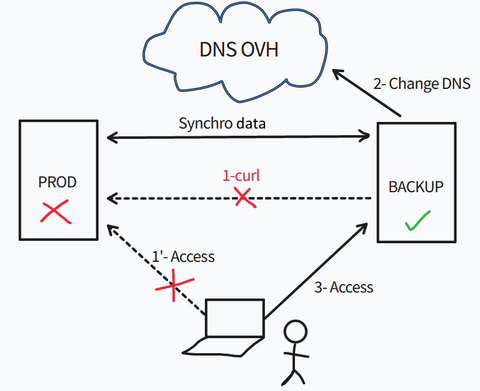
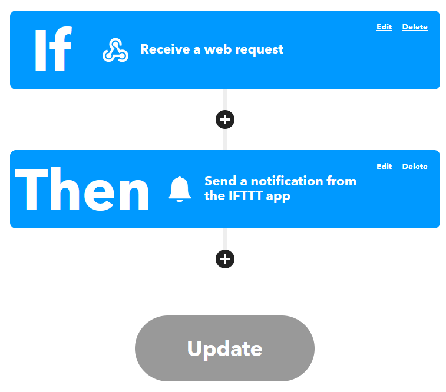

# Context

My hosted server has been having some issues lately, it tends to crash regularly despite the fact that I actively monitor it.  
For a long time I thought it was one of my docker containers going crazy (despite having runtime options configured) but it turns out it was the OVH metrics scraper that was causing the problem!  
Anyway, before resolving the issue, my hosted services would stop responding from time to time and that remains very annoying. I therefore had to think about a potential redundancy solution!

# Exploring solutions

I needed to find a solution to keep the most important sites always running in case of a major failure of my dedicated server while I find a long-term solution. To simplify the problem I only want to switch one site for now as it is frequently visited for professional reasons, the others are not really important.

Here is the equipment I have available:
- A dedicated public IP from OVH
- A server hosted at OVH
- A micro server with equivalent resources to OVH at home
- Fiber internet and a dynamic public IP (from my router)

Here are a few techniques I first thought of:

- Backup, Replica
- Cluster
- Failover solution

The **backup/replica** solution was immediately ruled out because it is not flexible at all. I already back up my server to my home but that covers more the configuration of my dockerfile and the data of some containers, nothing that would let me bring an infrastructure back up in 10 minutes automatically (especially for a solution meant to be temporary).  
For a **cluster**, that would be the ideal solution — in my case switching to Docker Swarm or even better migrating everything to K8s/K3s. The problem is that I want a solution that is quick to set up without requiring a complete overhaul of my infrastructure. Especially since I haven't thought at all about the design of my future infrastructure and how it would be managed with a dynamic public IP.  
The last option is probably the most suitable for me: find a simple and effective **failover solution** with minimal human intervention without touching the existing configuration.

Once chosen, I had to compare solutions against the following constraints:
- A switchover completed in 5 minutes max in case of a problem.
- All data must be identical and synchronized (if an HTML file is modified, immediate replication to the backup).
- Quick and simple to set up, no paid services, etc.

After some thought, here is the imagined workflow:



The detail of the flow would be as follows:
- Problem on production (OVH server) that makes the website unavailable
- A script on the backup server regularly checks the availability of the website
- The script detects the unavailability and via the OVH API changes the public IP of the site to point to the backup server itself
- With a sufficiently low TTL (60), the user should be able to access the website via the backup

There is still the subject of data synchronization, possible solutions:
- A mount on the website folder in question
- An rsync from the backup to production at a regular frequency
- An rsync from production to the backup whenever a file is modified

I spent quite a bit of time on these solutions because they all have their problems:
- **Mount**: No point because if production crashes I no longer have the mount and therefore no data, a copy is absolutely necessary. I could always use a cron job to regularly copy the data locally but there's no advantage over the other solutions.
- **Rsync from backup**: Not a big fan of creating access to my production server even if it's rsync via SSH key on a non-root user. But most importantly, how do I detect that a file has changed or been created? Only production can have that information. I did try to create an sshfs mount with folder monitoring via the inotify tool but they don't work together at all — inotify works with a local filesystem.
- **Rsync from production**: Last solution, this one seems the most "feasible" — production monitors its files via inotify or another tool and rsyncs on change. However with the dynamic IP I'm still "stuck" because every time my router restarts I get a new IP. I therefore had to use a DynDNS-type service; since my router only supports DynDNS or NoIP I chose the latter which has a freemium version (you have to manually validate the domain every month otherwise it's 5$/month...)

# Implementation

I have 4 parts to set up:
- The script to check website availability.
- The script to change the DNS.
- The tool that will allow data sync from production to the backup.
- Small auxiliary scripts to alert in case of production/backup failure.

All the scripting part will be condensed into a single script.

## Scripting part

```python
from urllib.request import urlopen, Request
from urllib.error import HTTPError, URLError
import sys
import time
import requests
import dns.resolver
import ovh

new_ip = requests.get('https://api.ipify.org').content.decode('utf8') #Dynamic public IP
domain = "<domain>"
site_name = "<the_website_to_monitor>"
ifttt_event = "<event_ifttt_name>" #See https://ifttt.com
ifttt_key = "<event_ifttt_key>" #See https://ifttt.com
ovh_secret = "<ovh_secret>" #See https://docs.ovh.com/ca/fr/api/first-steps-with-ovh-api/
ovh_key = "<ovh_key>" #See https://docs.ovh.com/ca/fr/api/first-steps-with-ovh-api/
ovh_consumer = "<ovh_consumer>" #See https://docs.ovh.com/ca/fr/api/first-steps-with-ovh-api/

# setting the URL you want to monitor
URL = Request("https://{0}.{1}".format(site_name, domain),
              headers={'User-Agent': 'Mozilla/5.0'})
i = 0

#Verify status of the DNS
result = dns.resolver.query(site_name, 'A')
for ipval in result:
    if ipval.to_text() == new_ip:
        print("Already switched")
        sys.exit(0)

#The site is answering ?
while i < 10:
    time.sleep(5)
    print(URL.full_url)
    try:
        response = urlopen(URL, timeout=2)
    except (HTTPError, URLError) as error:
        i = i+1
        continue
    if response.status == 200:
        print("Prod is okay")
        break
    i = i+1

#The website is down so we can switch and alert
if i == 10:
    response = requests.post('https://maker.ifttt.com/trigger/{0}/with/key/{1}'.format(ifttt_event, ifttt_key))
    client = ovh.Client(
        endpoint='ovh-eu',
        application_key=ovh_key,
        application_secret=ovh_secret,
        consumer_key=ovh_consumer,
    )

    result = client.put(
        '/domain/zone/{0}/record/5206233547'.format(domain),
        subDomain=site_name,
        target=new_ip,
        ttl=60,
    )

    result = client.post('/domain/zone/{0}/refresh'.format(domain))
```

The script above was set as a cron job on the backup server and runs every 10 minutes.  
It performs the following actions:
- DNS check (has the site already switched over?)
- Curl to the site in question, 10 tests with a 5s interval
- If down, switches to the backup via the OVH API
- Notification (we'll cover that in another section)

## Data synchronization

For the sync I had initially thought about inotify with rsync.  
It would have been enough to launch the binary (via systemd ideally) and whenever it detected an event matching the specified options (create, delete, move, etc.) it would perform an rsync.  
The problem is that this requires quite a bit of tinkering (script, creating a systemd service, etc.) and I wanted to avoid that as much as possible.  
Fortunately I came across the tool **lsyncd** which does exactly this job — no need to reinvent the wheel!  
On top of that it can use rsync to perform its actions which is perfect for me. I made two configurations:
- One for the webroot of my site: on any modification/addition/deletion lsyncd immediately runs an rsync to my backup
- One for the certificates folder of my website: since I'm using LetsEncrypt, certificates are renewed regularly. Likewise, whenever they are modified (the public certificate mainly) it copies the new certificate to the backup

All of this is great but I'm still missing the pure SSH part since my backup server is hosted at home behind my router. I already use port 22 for other purposes so I need to do some additional configuration.  
I had two options:
- NAT on a different port than 22 (e.g. PUBLIC_IP:2222 --> backup:22)
- Set up an SSH bastion with hardening that forwards my requests to my backup

I decided to go with the second solution — it's a good opportunity to practice something I don't usually do. I'll skip the hardening part as it's not what I want to cover in this post, but it involves the following (non-exhaustive):
- Fail2ban
- No PermitRoot
- Key-only authentication
- A chroot jail with a limited set of binaries (goodbye su and sudo 😈)

Regarding the bastion, 3 solutions for making this jump:
- Storing SSH keys on the bastion
- SSH agent forwarding
- Using ProxyCommand/ProxyJump


**Storing SSH keys on the bastion**: This means the bastion holds the private SSH key of my backup server — since it remains public this is always risky. Let's set this idea aside for now.  
**SSH agent forwarding**: We pass our private keys to an SSH agent and forward that agent to our bastion. The SSH agent being a Unix socket (bound to the `$SSH_AUTH_SOCK` variable) the jump host will point to our local agent instead of its own. But being root on the bastion is enough to redirect the `$SSH_AUTH_SOCK` variable to our socket and access the backup. Not great security-wise either.  
**ProxyCommand/ProxyJump**: The best solution — the intermediate server (the bastion) executes a `ProxyCommand` during the connection and forwards input and output to the backup. You just use the `-J` option of the SSH binary.  
Ex: `ssh -J username@bastion username@backup`. The only problem with this solution is that if I want to specify a private SSH key, the command can't know whether it applies to the bastion or the backup. I therefore went through the SSH config:

```
Host bastion
    User linux
    HostName bastion.domain.tld
    IdentityFile ~/.ssh/bastion_rsa

Host backup #No need to be accessible from the internet
    User backup
    HostName backup.domain.lan
    IdentityFile ~/.ssh/backup_rsa
    ProxyJump bastion.domain.tld
```

And when I simply run `ssh backup` (after copying the public keys to the right servers) the magic happens! Quick test modifying a file — it works perfectly, the modified file is properly propagated to the backup 🙂

## Notifications

Last point: the finishing touches! It's now about getting alerted in case of production OR backup failure (you never know, it can crash too!).  
For the backup I do almost the same thing as the script above — I have curl requests that regularly query the DynDNS name pointing to my website (I configured my Nginx reverse proxy to respond to both the real site name and the DynDNS name). In case of failure I receive an email on my personal mailbox.

However for production it's more complex (and more important too). I could actually use the same mechanism as for the backup but I would never receive the email because my mail server is hosted on the same machine as my website...  
I started looking into using the Gmail API but honestly it didn't appeal to me much.  
So instead I used the **IFTTT** service — I found the concept so simple and effective.  
An Android (or Apple) app to download, then "program" your alert:



As you can see above, upon receiving a webhook a push notification is sent to the IFTTT app linked to the account.  
I just had to add the curl command to my script above and it was done — works perfectly! Very little information is also transmitted to this third-party service (probably a public IP and maybe some negligible info about my phone) which remains acceptable to me. The business plan consists of offering premium versions that allow you to develop your own algorithm or have more events.

# Conclusion

A full day's work to design, implement and fine-tune. I hoped not to take more time and mission accomplished.  
I have a solution — admittedly a makeshift one — but functional and easy. I still have one manual part: in case of production failure and switchover to the backup, I have to manually point the DNS back to production (though I use a script for that).  
The solution is anyway only temporary while I think about a new architecture that will be much more robust and planned from the start.  
It remains nonetheless a very good exercise — very close to the system level, it always feels good to get your hands dirty 🙂