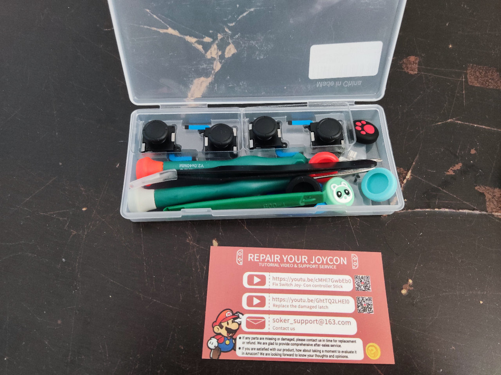
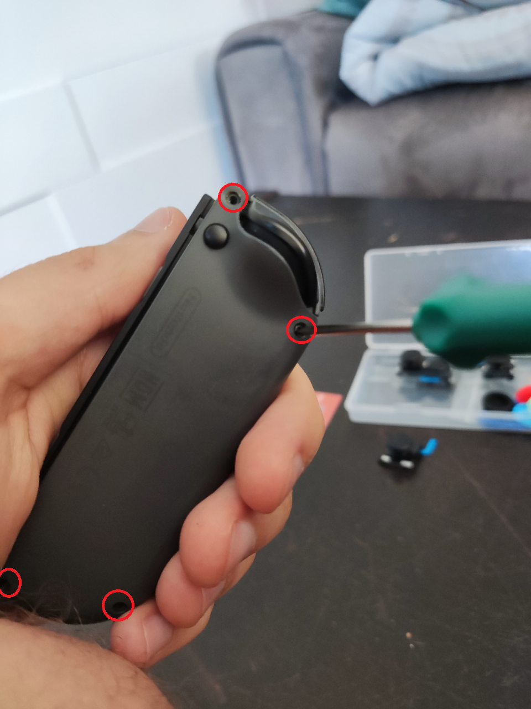
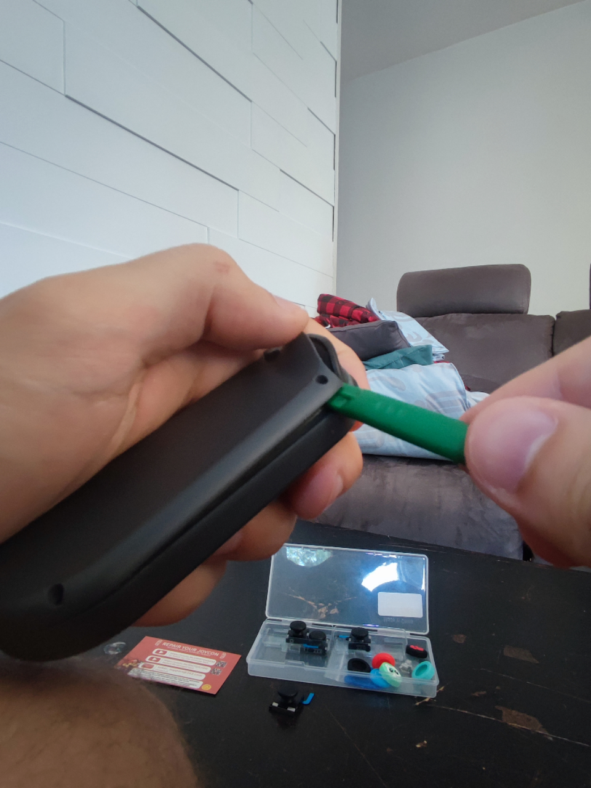
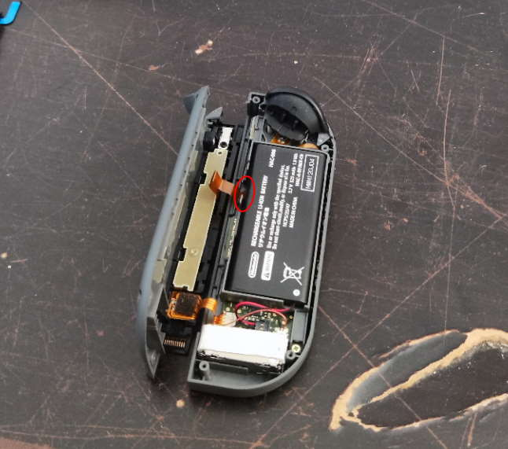
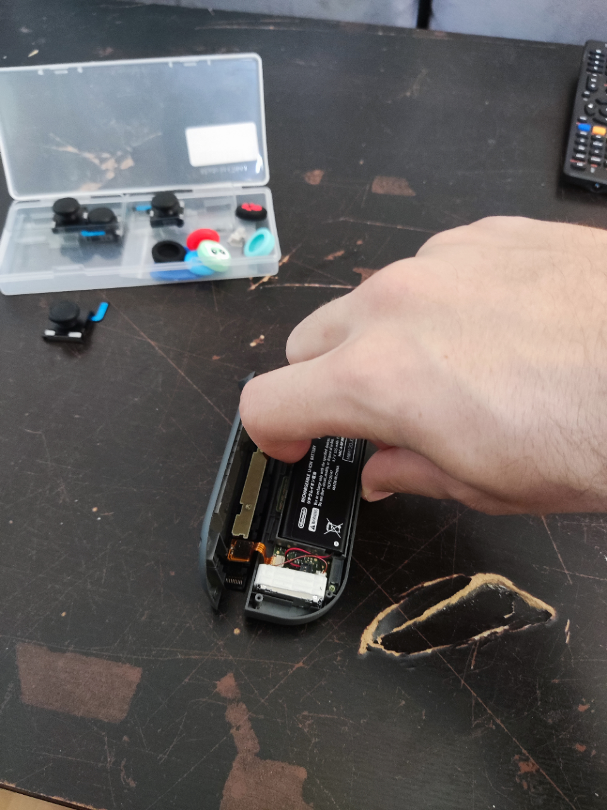
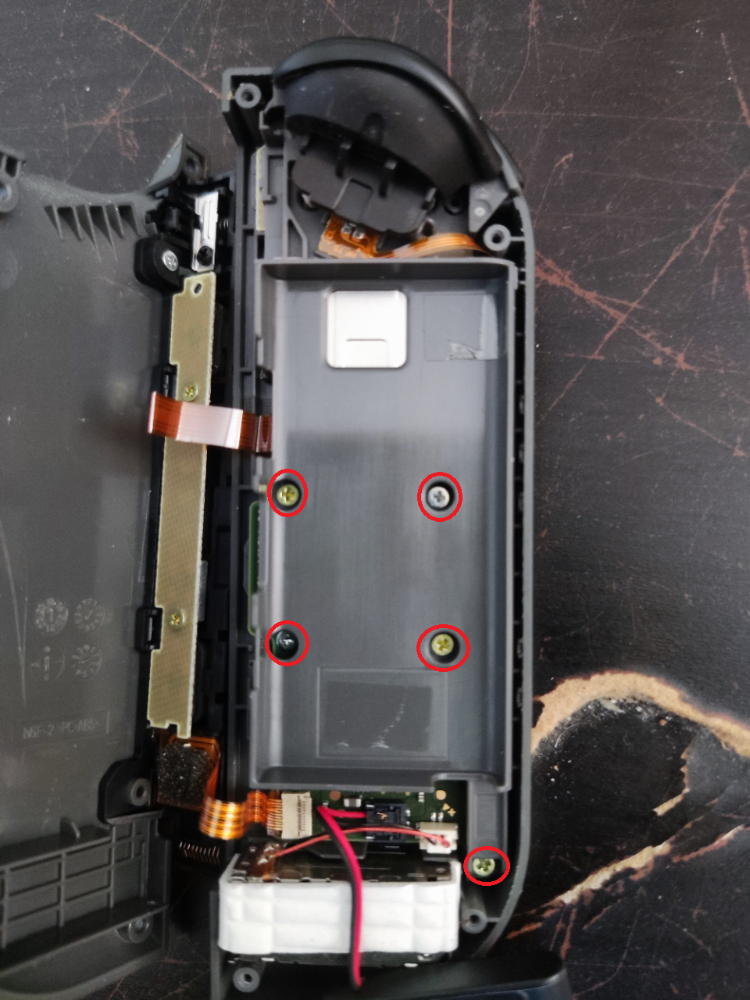
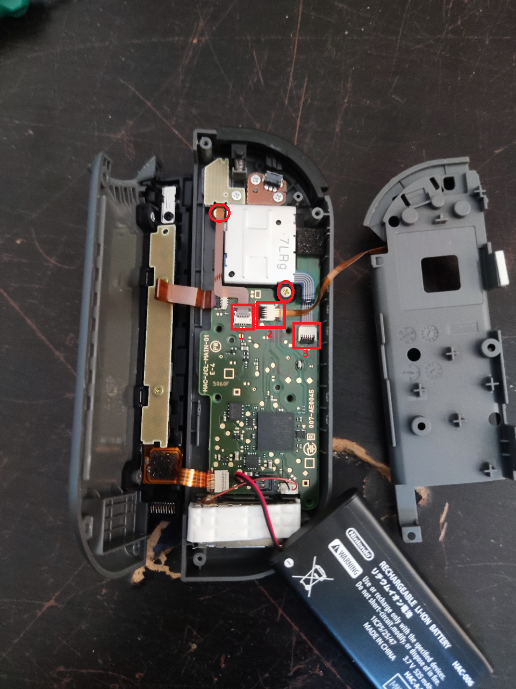
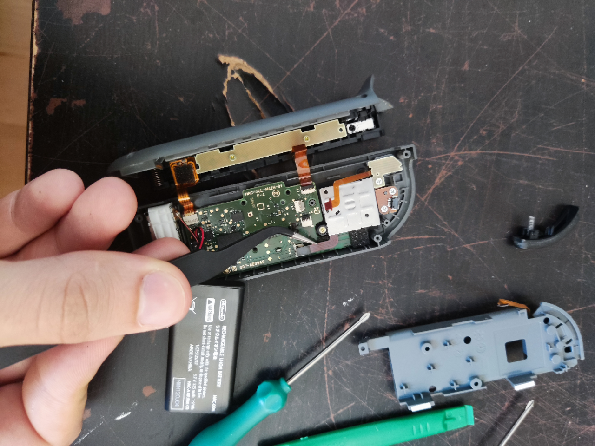
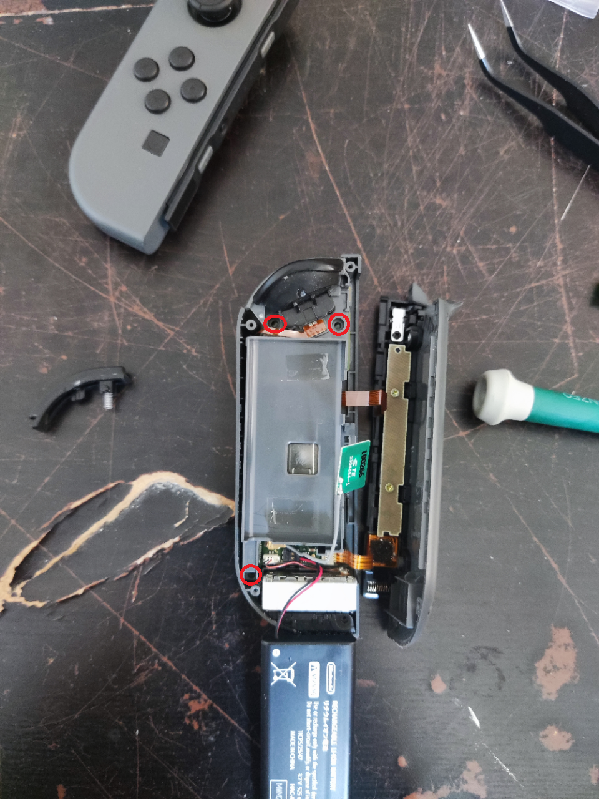
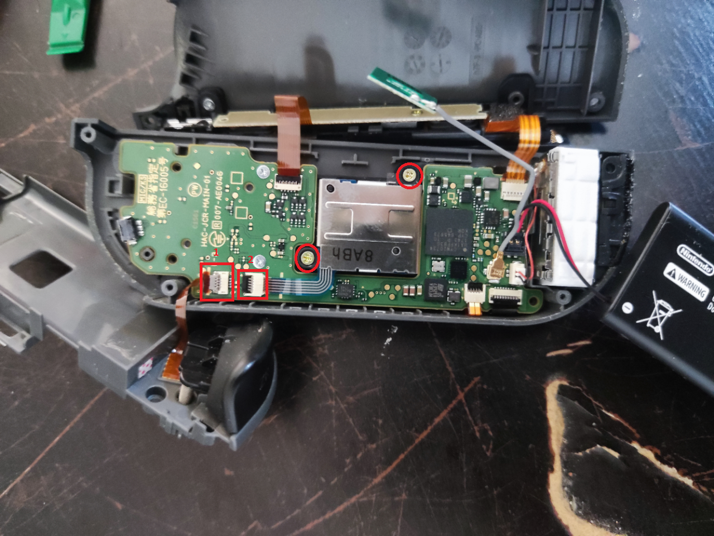

# Context

Done! I finally got the infamous joycon drift on both joycons of my switch. As a reminder, for what joycon drift is, see [here](https://www.nintendo.com/en-gb/Support/Repair/Joy-Con-Control-Sticks-Are-Not-Responding-or-Respond-Incorrectly-responsiveness-syndrome-or-so-called-drifting--1867803.html).  
It doesn't really prevent me from playing but it remains very annoying and sometimes even handicapping in certain games, so I started thinking about replacing or repairing my joycons.

# Tools

Of course this is a problem encountered by all switch users at some point, so there are plenty of tutorials/videos on the internet.  
What came out of the resources I consulted is that I needed two specific screwdrivers:
- Y00 Triwing Screwdriver
- PH000 Phillips Screwdriver

At first I wanted to only get these two screwdrivers and use a piece of cardboard paper (like a business card) that is supposed to be placed just under the joycon. But I had trouble finding these two screwdrivers on their own (aside from Chinese sites like Aliexpress which I don't want to use...)  
So I went with this [pack](https://www.amazon.ca/gp/product/B08CS7DS5V/ref=ppx_yo_dt_b_asin_title_o00_s00?ie=UTF8&psc=1) for 20 CAD ! Maybe a little expensive but it has everything inside:
- Y00 Triwing Screwdriver
- PH000 Phillips Screwdriver
- 4 new joysticks
- A tweezer
- A "Plastic crowbar"
- Various hardware (L/R button springs, Slider Lock, screws, etc.)
- Cosmetics for the joycons

# Repair

Ok now that we're equipped, it's time to get to work! To do this, you need to clearly distinguish the right joycon from the left one as they are assembled differently.  
I think you should count about 30 minutes for both joycons to be safe.

## Right Joycon

We will first remove the 4 screws circled in the photo below:  

Once the 4 screws are removed, slide the "plastic crowbar" into the gap that has appeared after removing the screws:

Then simply **carefully** open the joycon and here is its content:  

You can notice that the two parts are connected with flat flexible cables. Now you need to remove the battery, gently push at the area circled in red.

To get this:

From this point you will need to remove the 5 circled screws to be able to remove the battery cover:

This is where the most technical part will take place. First you will need to remove the 3 flat cables circled with a red square. To do this you need to perform the following two tasks:
- Lift the small black tab (or grey for square #1)
- With your fingers or the tweezer, carefully remove the cable

Then remove the two circled screws which will free the joystick and you can put one of the new joysticks in its place.  

And that's it! You just need to do all the previous operations in reverse and reassemble the joycon. Note that when inserting the flat cable I strongly recommend using the tweezer to be more precise:

No need to push all the way in, once re-inserted you need to lower the plastic tab that was previously raised.

NB: It's possible that the L/R button may escape (on the right in the photo above), you need to re-clip it before reassembling the shell that was removed in the first step.

## Left Joycon

The left joycon is slightly different from the right one. Here are the differences:

Remove the 3 screws circled above. Once the battery cover is removed, here is what it looks like:

Remove the two flat cables circled above then the two circled screws. And that's it!

# Conclusion

Nothing too complicated in this joystick replacement on the joycons, you just need to be meticulous and well-equipped! 