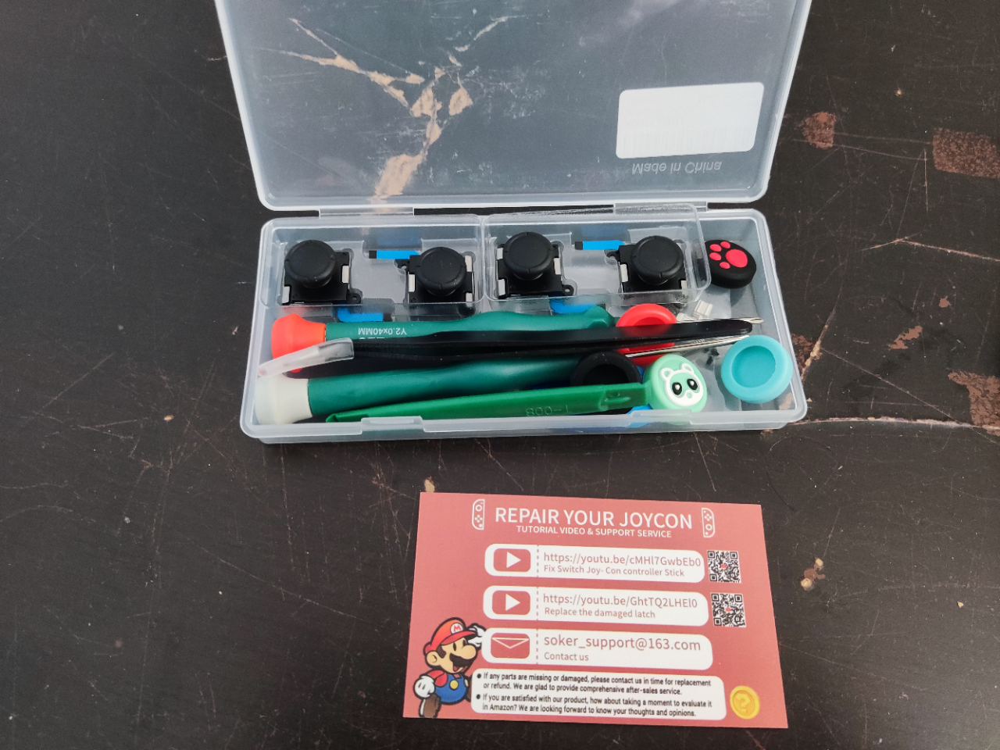

# Contexte

C'est fait ! J'ai enfin eu le fameux joycon drift sur les deux joycons de ma switch. Pour rappel ce qu'est le joycon drit voir [ici](https://www.pocket-lint.com/fr-fr/jeux-video/actualites/nintendo/148751-comment-reparer-nintendo-switch-joy-con-drift).  
Cela ne m'empêche pas réellement de jouer mais cela reste très pénible voir même parfois handicapant dans certains jeux, j'ai donc commencé à réfléchir à changer ou réparer mes joycons.

# Outils

Forcément c'est un problème rencontré par tous les utilisateurs de la switch à un moment donné donc il existe une foison de tutoriels/vidéos sur internet.  
Ce qui ressorti des ressources que j'ai pu consultées c'est qu'il me fallait deux tournevis spécifiques :
- Y00 Triwing Screwdriver
- PH000 Phillips Screwdriver

Au début je voulais prendre uniquement ces deux tournevis et utiliser une feuille de papier cartonnée (type business card) qui est censée être placée juste en dessous du joycon. Mais j'ai eu du mal à trouver ces deux tournevis seuls (hors site chinois type Aliexpress par lesquels je ne veux pas passer...)  
Je suis donc parti sur ce [pack](https://www.amazon.ca/gp/product/B08CS7DS5V/ref=ppx_yo_dt_b_asin_title_o00_s00?ie=UTF8&psc=1) à 20 CAD soit environ 15€ ! Peut-être un peu cher mais là il y a tout dedans :
- Y00 Triwing Screwdriver
- PH000 Phillips Screwdriver
- 4 joysticks neufs
- Un tweezer
- Un "Plastic crowbar" (pas trouvé le nom en français)
- De la visserie en tout genre (ressort boutons L/R, Slider Lock, vis etc...)
- De la cosmétique pour les joycons

# Réparation

Ok maintenant qu'on est équipé il s'agit de passer à la pratique ! Pour cela il faut bien distinguer le joycon droit du gauche car ils sont montés différemment.  
Je pense qu'il faut compter environ 30min pour les deux joycons pour être large.

## Joycon droit

On va tout d'abord enlever les 4 vis entourées sur la photo ci-dessous :  

Une fois les 4 vis enlevées, passer le "plastic crowbar" dans la fente qui vient d'apparaître suite aux vis enlevées :

Il suffit ensuite de **délicatement** ouvrir le joycon et en voici le contenu :  

On peut remarquer que les deux parties sont reliées avec des câbles plats flexibles. Maintenant il faut retirer la batterie, légèrement pousser à l'endroit entouré en rouge.

Afin de donner ça :

A partir de ce point il va falloir enlever les 5 vis entourées pour pouvoir retirer le cache de la batterie :

C'est ici que la partie la plus technique va s'opérer. Il va falloir dans un premier temps retirer les 3 câbles plats entourés par un carré rouge. Pour faire cela il faut réaliser les deux tâches suivantes :
- Relever le petit ergot noir (ou gris pour le carré n°1)
- Avec les doigts ou le tweezer délicatement retirer le câble

Puis retirer les deux vis entourées ce qui va libérer le joycon et vous pourrez mettre à sa place un des nouveaux joycon.  

Et voilà ! Il "suffit" de faire toutes les opérations précédentes à l'envers et ainsi remonter le joycon. Attention pour mettre le câble plat je recommande vivement d'utiliser le tweezer afin d'être plus précis :

Pas besoin d'enfoncer jusqu'au bout, une fois réenfoncé il faut descendre l'ergot en plastique relevé précédemment.

NB : Il n'est pas impossible que le bouton L/R vienne à s'échapper (à droite sur la photo ci-dessus), il faut le reclipser avant de remonter la coque qui a été enlevée lors de la première étape.

## Joycon gauche

Le joycon gauche est légèrement différent du droit. En voici les différences :

Retirer les 3 vis entourées ci-dessus. Une fois le cache de la batterie enlevé voilà ce que ça donne :

Retirer les deux câbles plats entourés ci-dessus puis les deux vis entourées. Et voilà !

# Conclusion

Rien de bien compliqué dans ce changement de sticks sur les joycons, il faut juste être minutieux et bien équipé ! 