```toc
# This code block gets replaced with the TOC
```

# Context

It's been a while since I've had all my servers and network equipment stacked under my TV in an iterative way—growing each time I bought a new device—with cables forming what looked like a giant plate of spaghetti.
I thought I needed something to organize all of this neatly, to avoid screaming in my head every time I saw it, and to get fewer complaints from the people I live with 😅

At first, I considered just tying up the cables to make it cleaner and maybe improve the stacking (~2 hours of work). But scrolling on Twitter and Reddit started me down a slippery slope: https://www.reddit.com/r/homelab/. Then I asked myself: why not do something better? (turns out to be ~2 months of work 🥲)


# The study

## The rules of thumb

Ok now I have the all the prerequisite I need to organize myself and create the **4 Commandments** arround my rack :
- 📦 **You shall not move**! This is the first and most important rule. The ultimate goal is to lift the rack and swing it up-down, left-right, front-back—and nothing should fall or shift (a tiny bit of movement is fine, though). The final test will be to transport the rack from a room to another
- ✨ **You shall be clean**! As mentioned above, I don't want to eat spaghetti ever again ! Everything should be as neat as possible—perfect cable management, consistent spacing between rack mounts, no awkward gaps, etc.
- 🍩 **You shall be whole**! I don't want multiple racks—I want a single, unified rack that gather every devices I own.
- 🌸 **You shall be kawaii**! This one is optional… but I want it to look good: thoughtful color choices, shapes, models, and overall aesthetics.

The emojis are here to illustrate my thought process while applying these commandments.

## The rack

OK, so I know the direction I want to go, but I still didn't know exactly what I wanted! I started by listing the requirements and constraints:

- I wanted something **as small as possible** while containaing all my devices (🍩). My house isn't that big, and just imagining a full-size rack at home gave me PTSD. Besides, I don't need something huge because all my devices are pretty small.
- Since I was committing to something completely different, I wanted it to be **as clean as possible** (✨). Otherwise, just buying a shelf at IKEA would have done the job.
- I wanted the **possibility to learn something new**. I'm not really much of a handyman, so this could be a good opportunity.

After reading hundreds of posts (thanks to this [sub](https://www.reddit.com/r/minilab/) !), I finally decided on this [beauty](https://deskpi.com/products/deskpi-rackmate-t2-rackmount-12u-server-cabinet-for-network-servers-audio-and-video-equipment). It fits all my requirements:

- As small as possible
- Praised by the communit
- Beautiful metal rack mount (🌸)
- **Supported by a full community of 3D printing enthusiasts**, with the company itself publishing models

The only clear drawback is the **price** — it's definitely expensive, but I was willing to pay for it.

I mentioned it above, but the real rabbit hole started with the 3D printing side of things. It sparked my curiosity about what could be done with a 3D printer, combined with my racking project. The possibilities are omega huge! It also fit perfectly with my desire to **learn something new**.

## 3D printer

So here I was, figuring out which 3D printer to pick. My constraints were:

**Affordable**, since this project was already becoming a money pit
**Compact**, for the same reasons as the rack — space is limited
**Easy to use**, since I'm a newbie and don't want to spend too much time troubleshooting

After hours of YouTube research, I finally chose the [Bambu Lab A1](https://ca.store.bambulab.com/products/a1?srsltid=AfmBOorRvmZnjjrHdsQ0R7hXmVux8LDAp3Hmr3m0P_9KM7QAz-Cy8A4f). It met all my constraints : 
- Not expensive since this project starts to become a money pit
- Not too big for the same reason than the rack (I don't have lot of space). The size was perfect, capable of printing 256×256×256 mm, which is slightly wider than a 10" rack.
- Easy to use since I am a newbie and I don't want to spend too much time around this 

After 1–2 weeks, I had the perfect setup, ready for industrial-grade 3D printing !

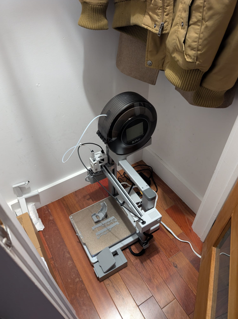


# The rack itself !

## Rack order and placement iteration

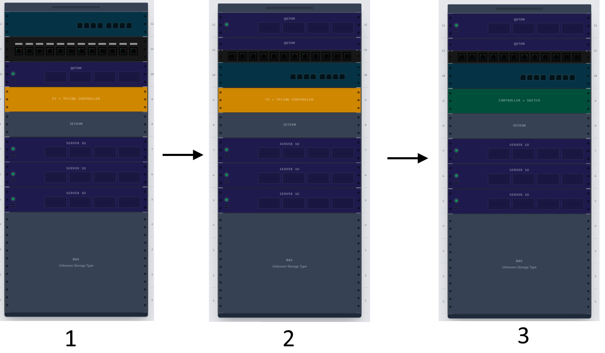

I also defined some "core" rules (again) for my front panel design (✨) : 
- Width is 25.4cm
- Height is 44.45cm
- Depth is 4cm

## 1 - Firewall

🖥️ **Hardware** : QOTOM Q730G5 Barebone Mini PC – Intel Quad-core J4105, AES-NI, 5 Intel 2,5 G LAN, 10 W (8G RAM, 32G SSD)  
🗺️ **Model** : https://www.printables.com/model/1611162-qotom-q730g5-for-10-rack

The Qotom (that is hosting the firewall) doesn't have a standard size (I would fit in 1.5U but not only 1). Anyway no models were found for this one So I decided to create my own model but also to put it on the top of my rack to avoid losing some precious space and keep it under 1U

### 1st iteration

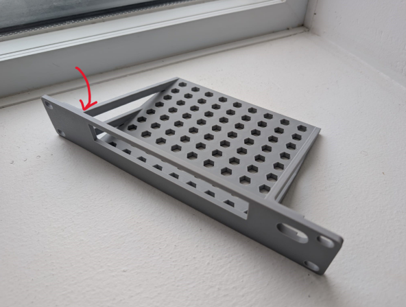
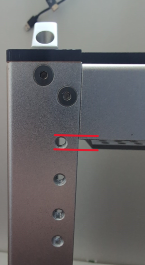


4 problems with this iteration : 

- Top bar was clearly not needed and the clearance for USB/HDMI cable can be too tight (pass for me still ok then)
- The hole on the right of the front plate can be too small (pass for me still ok then again)
- I need to align the octagonal base holes with the holes of my qotom that are in the underside face so I can fix it and it won't move in case of leaning
- The slanted bar under the red arrow prevent me to stick it to the desk pi rack because the top holes to rack it are too high and annoyed by the top metal horizontal bar
- Speaking about this top metal horizontal bar, it has a certain width that prevent my to stick my Qotom to the front plate (there is a 1/2 cm of space)

### 2nd iteration

3 choices : 
- I reduce the height of the oblique bars (even if was supposed to add some robustness…) so I can stick it to the deskpi rack but still have the issue of the server not sticked to the front plate
- I switch back to 1.5U format so I won't be bothered anymore by the above constraints AND not putting it at top of my rack anymore to keep the oblique bars until the top of my front plate
- I switch back to 1.5U format so I won't be bothered anymore by the above constraints AND still putting it at top of my rack anymore but need to reduce the oblique bars height

Option 3 was picked

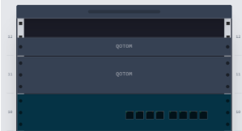

### 3nd iteration

I took option 3 but I realized that 1.5U is not great at all because then everything is shifted and won't fit very well (see below) because of the space between holes that is not consistent

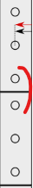

Due to those constraints I decided to extend it to 2U with a 0.5U patch panel (independent). So I needed to use a custom format which is not exactly 1.5U  
Then having this patch panel is changing everything I am thinking about reversing the qotom not having its front face but to benefit from the patch panel and use the rear face with all the ethernet port ==> That means I can remove the hole for the USB + HDMI cable (still I keep it for the power cable but reduce the size)  
Finally on my second iteration I forgot to align holes to fix it to the rack; it was fixed in this one

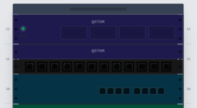

## 2 - Router

🖥️ **Hardware** : TP-Link Jetstream TL-SG2008P  
🗺️ **Model** : https://www.printables.com/model/1192281-10-inch-rack-tp-link-sg2210p-sg2008-sg105-m2

For the router (which functions more like a switch than a router), I used an existing model. However, I had to refine it slightly for two reasons:

- With my Qotom + patch panel setup, I am using roughly 1.5U, which is non-standard. This created an awkward gap between my TP-Link rack and the patch panel above. Increasing the height of the front panel made sense to fix this.
- Since I want to use the patch panel, I need to mount it on the reverse side (with the Ethernet ports facing forward). The original model wasn't fully designed to support this, and like the Qotom, I also needed to add a hole for the power cable.

## 3 - Omada Controller + switch

🖥️ **Hardware** : 
- TP-Link TL-SG105 5 ports 1G
- TP-Link Omada controller OC200  

🗺️ **Model** : https://www.printables.com/model/467925-tp-link-oc200-3u-rackmount-adapter-for-10-inch-net

I ran into a major issue with this DeskPI Rack T2: I don't have enough space! The 12U filled up quickly, and I had to make some choices because not everything fits (see the PI section below and the rack iteration section above).  
In the final rack configuration, I decided to merge the controller and the switch together because:

- They are small and can both fit in the same rack
- They are both linked to the above device : the TP-Link router

I create my own designed from this [model](https://www.printables.com/model/467925-tp-link-oc200-3u-rackmount-adapter-for-10-inch-net) but with few improvements/modifications : 

- I added openings on the base plate to be compatible with this [clip](https://www.printables.com/model/1395151-tl-sg108-rackmount-pin_clips) so I can securely clip my controller.
- Because the hole layout is different, I needed different openings for the switch, compatible with the clips I designed (see the section below on clipping).
- I integrated rectangular holes just above the devices to allow Ethernet cables to pass through neatly.

## 4 - JetKVM + KVM

🖥️ **Hardware** : KVM Ezcoo USB 3.0 KVM Switch HDMI 4 Computer 1 Monitor 4K 60Hz SPDIF L/R Hotkey EDID  
🗺️ **Model** : https://www.printables.com/model/1271417-10-rackmount-jetkvm-ezcoo-kvm-hotkey-supported-swi

Nothing relevant here except the fact I used this model above

## 5 - Mini PC

🖥️ **Hardware** : Beelink Mini PC, Mini S12 Pro Intel 12th Gen 4-Core N100 (up to 3.4GHz)  
🗺️ **Model** : https://www.printables.com/model/1032580-beelink-mini-s12-10-inch-rack-mount

Nothing relevant here except the fact I used this model above
## 6 - NAS

🖥️ **Hardware** : Synology DS918+  
🗺️ **Model** : https://www.printables.com/model/1383568-synology-ds920-nas-front-plate-for-deskpi-rackmate

At first, I was thinking of using this model above and have the same setup (NAS at the bottom of the rack)  
But once printed I realized that the holes where not aligned and I start to wonder how it was placed in the rack shown in the model's description. I think it's just sitting on the floor, which is a hard stop for me for 2 reasons:
- I don't want it on the floor to avoid excess dust (even though I know I can't completely prevent it).
- I want to respect the 📦 moving and 🍩 commandment which is clearly incompatible with having it on the floor
    
Next, I want my NAS to not move at all (to follow my 📦 commandment). Simply placing it on the shelf is not enough. I want to prevent movement along three axes:

- **X axis (left-right):** To prevent movement along this axis, I designed a custom door stop that can be screwed into the DeskPi (see image below).
- **Y axis (up-down):** This is less critical since it's very unlikely the NAS will move vertically. Still, I might add some protective foam in the ~2 cm clearance between the NAS top and the above rack to prevent any upward movement, for example when moving the rack.
- **Z axis (front-back):** To prevent movement along this axis, I used two instances of this model (M5_System20 Bracket 40×40 mm, with the brackets custom-removed) and screwed them to the shelf. It still moves slightly because I couldn't fully lock the nuts (this is noted in my remaining backlog).

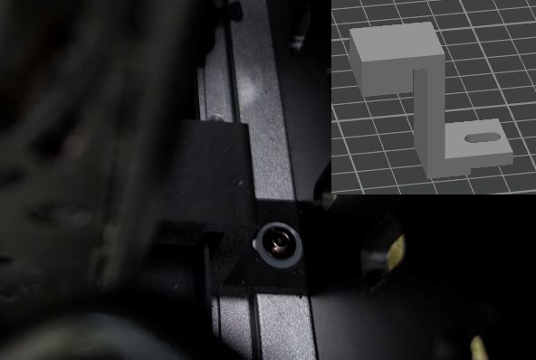

## 7 - Wifi AP

🖥️ **Hardware** : TP-Link Omada Business WiFi 6 AX3000 Ceiling Mount Access Point (EAP650)  
🗺️ **Model** : https://makerworld.com/en/models/480832-vertical-stand-for-omada-eap-6-series-v1?from=search#profileId-392486

The goal here is to host the Wifi access point at the same place as the other devices (🍩)
To hold it, I considered several options:

- Place it on the side of the rack
- Place it on top of the rack
- Place it inside the rack

Options 1 and 3 were quickly discarded, because there wasn't enough space for option 3 and because of the rack's position in the room for option 1 (one side is already used). Additionally, for both the orientation of the access point would not have been optimal for the setup I wanted.

This left only option 2, which allows for much more flexible positioning.

Indeed, I can place it vertically or horizontally, and in the horizontal position, I can choose its orientation. I considered several possibilities:

- Use a standard stand mount in a vertical position
- Use a horizontal stand mount, which comes in various designs, including one I really like that looks like a UFO (🌸)
- Create my own custom design to match a specific visual style

To simplify a project that was already becoming overly complex, I decided to go with a standard vertical stand mount using the model above that covers my need. I slightly redesigned it to add holes for screws (📦). It's already aligned with the holes present on the top cover of my DeskPI, nice !

## 8 - UPS

🖥️ **Hardware** : CyberPower CP1500GAVR 1500 VA

One final upgrade I added was a power‑backup system for power outages. Technically it’s optional, but where I live power cuts happen often — usually just for a few minutes — which is the perfect use case for an UPS (Uninterruptible Power Supply). I found one almost for free on the second‑hand market and bought two new batteries for it. It’s been working flawlessly.

After some discussion and reflection, though, I think that next time — once these batteries reach the end of their life — I’ll switch to a LiFePO‑based device, which is better suited for my homelab setup.

Anyway I will write a full article in the future about how I integrate it with my devices, because I have some 🌶️ ideas in mind... Stay tuned 👀

# Side stories about the rack

## Clip and morty adventuuuuures

I've been looking for a mounting or clipping solution for my different devices. Some of them can already be secured with screws because they have built-in mounting holes (looking at you, Qotom), but others are more challenging.
The main issue is with my TL-SG-105 switch and OC200 Omada controller. They aren't designed to be mounted horizontally or fixed in place—they're intended more for vertical wall mounting.
However, I want to install them horizontally in the same rack. I see two possible options:
- Design the rack so that each device fits perfectly into its slot, held in place by thin borders
- Use "clips" that act like screws to secure the devices directly to the rack


I chose option 2 because it would give me a more standardized solution (even though each device is different) without modifying the original rack model, which is definitely costly.
That said, it's not a final decision—at least for now—and I'm open to combining both approaches if needed.
I found this [model](https://www.printables.com/model/1395151-tl-sg108-rackmount-pin_clips), which is exactly what I was looking for. It fits my OC-200 perfectly, but I ran into two issues with the TL-SG-105:
- The mounting holes are not the same across devices, which caused problems for the TL-SG-105. The clip is slightly too thin for it, so it moves around, whereas it fits snugly on the TL-SG-105.
- The hole shape is quite specific, and while it might work, it's not ideal and doesn't feel like a sustainable solution. 

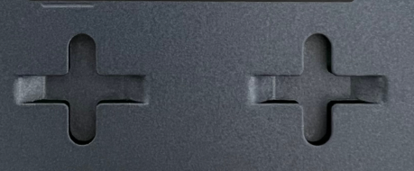

The first issue could be fixed fairly easily by increasing the diameter of the tip, but importing and modifying an STL file in Fusion 360 is quite challenging. However, solving the second issue would require designing a completely new model.
While I felt petty stuck I randomly thought about my wife hair pin and that it could have been much more than just a hair pin 🙂  
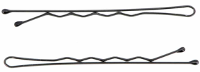

Surprisingly, the design matches what I'm looking for:
- Something versatile that can be easily inserted and removed
- Something strong enough not to break
- Something that can hold the device securely in place, even if the rack is shaken

I can also modify the rack model to follow the wavy shape of the pin and integrate that form directly into the design.

After a few (well… many) iterations, I ended up with something that isn't perfect but is usable and serves its purpose. The last bump at the end of the pin isn't really useful, as the pin lifts slightly too much and doesn't actually block anything. However, the second—and especially the first—bump work well. I tested it by shaking the switch quite hard, and aside from a small amount of movement due to a gap between the pin and the hole, it stays in place.

That said, this clip can't be used with the OC200 because its mounting holes are closed, whereas the SG105 has open slots that allow me to slide the clip in.

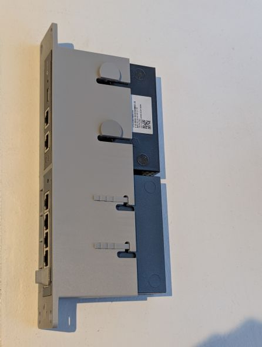

The model is [here](https://www.printables.com/model/1658542-hair-pin-clip-rackmount-tl-sg-105)

## The mini raspberry lab epic

I realized I don't have any space left for my Raspberry Pi in my DeskPi. On top of that, using 1U just for a single Raspberry Pi feels like a waste of space.
So I started looking at existing models to store it outside of the rack. I found two options:
- This [model](https://www.printables.com/model/1148390-rack-raspberry-pi-5-case): It's pretty simple and has the advantage of being rack-mounted like the others, but on the backside. It's solid, but very much a "keep it simple" solution.
- This [model](https://www.printables.com/model/508997-appleberry-g5-raspberry-pi-3b-4b-in-apple-power-ma): This one is clearly more fun, though not really optimized. At first, I had no idea where I would put it (maybe on top of the DeskPi?).

In the end, I went with the fun option. In the meantime, I had installed a Skadis side plate to hold the power supplies for my devices, so mounting it there on a mount plate solved the "where to put it" problem. I also really liked the design—I wanted to add a bit of personality and a touch of madness to the rack (and respect the 🌸 commandment).

4 components for this setup:
- Skadis side plate – already installed
- Appleberry model – to house the Raspberry Pi
- [Mount plate](https://www.printables.com/model/114897-ikea-skadis-hi-capa-stand-mount), used to hold the Pi on the plate
- [Skadis T-Clip System](https://www.printables.com/model/256896-skadis-t-clip-system), to clip the mount plate securely to the side plate

**1st iteration :**

I wanted to respect the 📦 commandment and therefore attach the overall setup
Once printed I realized that the T-Clip has not the right size and that the combination of the side plate + mount plate is too thick
Also realized that I forgot two holes 🤦

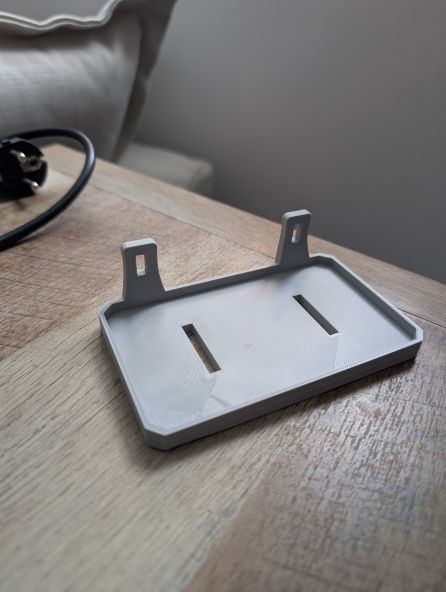

**2nd Iteration :**

Instead of modifying the T-Clip itself, I reduced the width of the mount plate so it could fit both the side plate and the T-Clip mount plate.
I also added the missing holes and shortened the length from 20 cm to 12 cm to save space (a small nitpick, but it makes a difference).

**3rd Iteration :**

I noticed that the HDMI and USB power cables for the Raspberry Pi exit from the side, which gave me two options:
- Plug from the top – but this would look messy, with two visible cables going up and then looping down to join the other cables (Ethernet + USB).
- Plug from the bottom – which requires enlarging the holes, because the current ones are only sized for Velcro strips.

I picked the bottom option to have a cleaner state
Then on this iteration I just asymmetrically raised the width of one hole for the USB and added one hole for the HDMI one

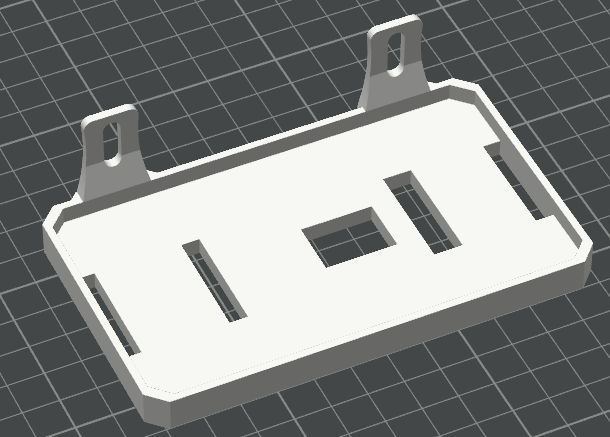

Here a picture of the final setup

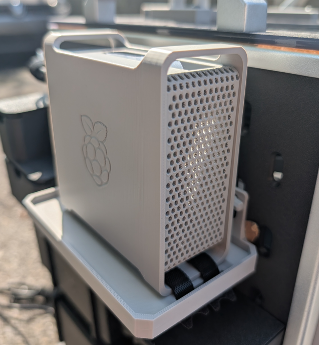

## The Cable Management Hell (✨)

After reading lots of Reddit posts of people showing off their racks, I noticed that most of them only displayed the front and rarely the back. My guess was that the rear wasn't always clean (hello, spaghetti plate), so they might not share it.  
But me, as I mentioned at the beginning, I want mine to be suuuuper clean, so I rolled up my sleeves and got to work. The biggest issue here is that I am not known to be this kind of person (clean and organized) but well never too late to improve ! I started by listing how to make it as clean as possible:

- Use cables with custom lengths to avoid dealing with excess.
- Have a dedicated space to manage cables both inside **and** outside the rack (for non-customizable cables like power ones).

For that I did the following : 

- Print a few of this [model](https://makerworld.com/en/models/19829-1u-rackmount-cable-management-rings#profileId-18491) to have my cable to be rail-guided
- Designed my own [cable guide](https://www.printables.com/model/1658529-rack-10-cable-guide) to keep cables rail-guided **inside** the rack
- Completely reprinted one side of the T2 DeskPI rack to make it Skadis-compatible, thanks to this awesome [model](https://www.printables.com/model/1442061-deskpi-rackmate-t2-skadis-side-plate)
    - Print this [cable channel model](https://www.printables.com/model/631869-skadis-cable-channel) for the Skadis
    - Print and designed custom [power supply holder](https://www.printables.com/model/1531858-ikea-skadis-power-supply-holder-for-synology-ds918)
- Velcro for the win (seriously this was a game changer)

The Skadis is supposed to host :

- All the power supplies (3 for me) of my devices
- Power bars (2 for me), so I can merge my power inputs here and then connect them to my UPS.
- The infamous raspberry setup
- Small drawer because… why not ? Always useful for storing small things (screws, NAS disk key, remote for the KVM, spare parts etc…) 

### The Good : USB/HDMI cables

This part went surprisingly well, or at least much better than I expected. I bought some 1 m HDMI and USB cables, and thanks to the cable holder mentioned above and the tons of Velcro I used, the result turned out pretty neat. I was genuinely happy with it.

### The Bad : Ethernet cables

I thought it would be clever to customize the length of my Ethernet cables since I knew it was feasible (and to follow my will to have something custom). So, I bought a complete kit on Amazon to crimp my Ethernet cables.
It turned out this part was an absolute **nightmare** : 

- **First** because I did buy a cheap Chinese crimp tool that was able to crimp 1 cable on 10 correctly. At first, I thought it was just because I was a newbie, but by the tenth cable, I realized the tool itself was the problem.
- **Second**, it takes  A LOT OF TIME and since I'm not a very patient person, repeatedly arranging the 8 pairs of 1 mm wires—only to mess up the order almost every time—made me want to scream so hard.
- **Third**, it was really hard to estimate the exact length needed. Sometimes the cable ended up a bit too long (fine, better than a standard static cable), but sometimes it was too short, which meant wasted cable and wasted time ! 
    
Thanks to this experience, I realized I'm just not made for it—and honestly, I didn't enjoy it at all 🙂. Fortunately, I had read enough posts to know that making custom patch panel cables was unnecessary, so I just bought pre-made ones instead.

### The Ugly : Power cables

This part was a bit complicated because the power cables are : 

- Thick (depends which ones but generally thick)
- Hard to control or twist (again because they are thick)
- Long

Unlike the Ethernet and USB/HDMI cables, I had to route them on the outside of the cluster along the Skadis side panel to connect 7 of them to the 2 power strips I had clipped in place. The bottom of the Skadis quickly become a war zone with so many cables that I tried to tidy them as much as possible using Velcro.
Hiding them was a real challenge:

- I squeeze them under the power strips
- I used a large black box (that I 3D modeled) to cover the cable (TODO: insert picture here) and hide the chaos.


---
**To conclude** : As expected, while everything looked perfect on paper, the execution turned out a bit messy and somewhat a bit discouraging.
But well at the end I wasn't disappointed and pretty proud of the result, I know that it could have been waaaay better but knowing myself and what I am able to achieve I was satisfied with the result !
Some pictures on how it looks at the end


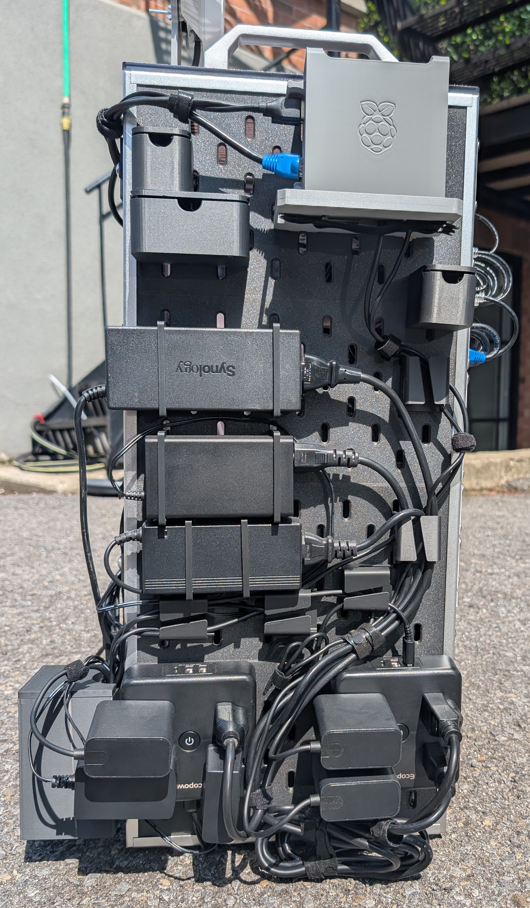
I just noticed the Synology logo upside down, it makes me crazy 🙃

## The cable cover journey

One issue with the current setup was those ugly holes for cable passthrough (Ethernet, power cable etc...). Very useful but very ugly

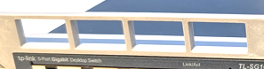

I need to fix this (✨), then what it the best way ? I though about multiple solutions : 

- Use a simple cover that would slide inside and close the hole. There would also be an opening from the middle to the bottom to allow the cable to pass through.  
**Constraint**: It doesn't hold very well and could not meet the moving requirement (📦).
- Use a cover fixed with several magnets placed both in the cover itself and in side ears .  
**Constraint**: This requires redesigning the models, reprinting them, and purchasing magnets.
- Use a cover that would be screwed onto the side ears.  
**Constraint**: I would need to modify the models and reprint them.

### Iteration 1

I decided to be ambitious and use magnets.This required me to print and purchase several necessary accessories:

- A set of magnets in various sizes
- Strong glue
- A magnetic pen to insert the magnets into their slots

I also had to redesign several models that contained holes to integrate the magnet placements.
The cover was shaped with two small "ears" containing magnets along with a larger magnet at the front. The idea was to remove the cover using a small metal bar.

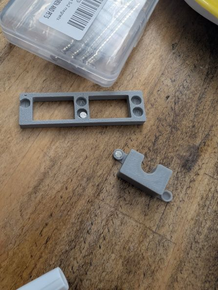  

In the end, this was not a good solution. It was quite complex in terms of magnet usage (requiring a total of five magnets per cover), and I realized that the central magnet was not strong enough to remove the cover effectively.

### Iteration 2

Based on these observations, I decided to keep the external extensions but remove the magnets from them. There would no longer be magnets in those parts, but I kept the central magnet. I also added a hole in the cover to make it easier to remove using an external rod (a locking system).  
Ultimately, neither the magnet nor the locking system proved practical, for different reasons. The magnet was not strong enough to remove the entire cover since it was positioned on one side—it could lift one side but not the other. Even adding two magnets (one on each side) did not solve the issue if the cover was inserted too deeply.  
The locking system could have worked, but honestly, it did not produce a good finish when printed and did not allow for precise operation.

### Iteration 3

I decided to abandon the magnet approach and focus on a single system to remove the cover. At first, I considered adding a pull tab to make removal easier. However, this caused problems during printing: since the model was never flat, supports were required, which resulted in a finish that was, at best, unattractive and, at worst, unusable.  
Additionally, the pull tab would need to be large enough to grip with fingers, while the goal was for the system to remain discreet.  

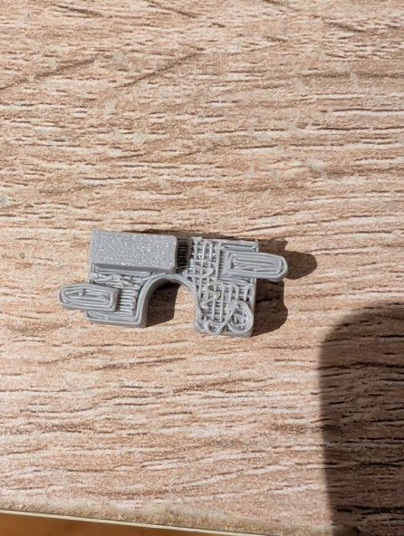

### Iteration 4

I ultimately chose a solution using an arch and a small rod to remove the cover easily. I kept the external "ears" to provide extra stability.  

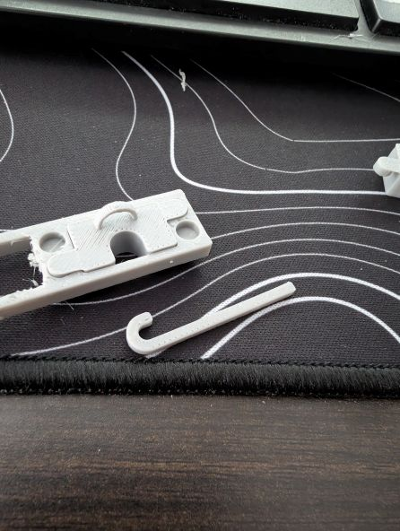

---
"All that… for this?"  

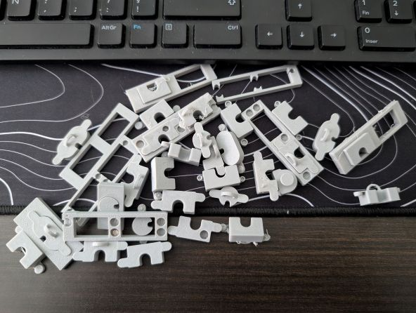

## The logo battle (🌸)

I wanted to add logos to my front panel to make it look nicer and to make each rackmount’s purpose immediately recognizable at a glance. I did a first iteration, but it was a mess. The logos were:

- Not aligned with each other
- Not the same size
- Ugly

So I asked my wife, who is a bit of an artist, to design the logos and create something more coherent:

- The logos fit within a 2×2 cm square
- The logos are all flat (no 3D perspective)
- The logos are vertically aligned with each other (1.15 mm from the border)
- The logos are recognizable at first glance

I created two iterations—one normal and one reverse and we chose the bottom one.

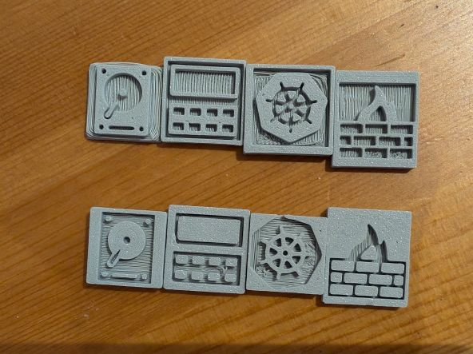


# Conclusion


Overall it was a super experience I had to learn multiple things which was really cool. I can even reuse some of the skills I learned during this project (3d printing for instance)  
Also now that the "hardware" part is done, I will throw myself into the software one to configure all this !

Special thanks to everyone I shared this project with, and particularly to one coworker who gave me access to a 3D printing software training course (Autodesk Fusion).